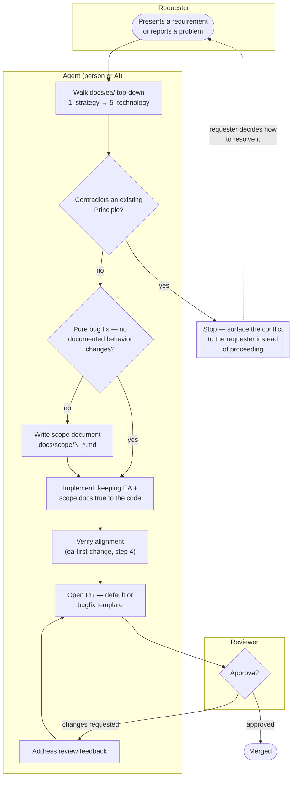

# Contributing

## The working method: EA first

This repo practices **architecture-first development**: strategy and
business architecture are validated before information, application, and
technology — and all of it before code. The full process is described in
[docs/scope/README.md](./docs/scope/README.md); in short, for any change in
requirements:

1. **Align the EA** — walk [docs/ea/](./docs/ea/README.md) top-down
   (`1_strategy` → `5_technology`), updating the affected documents.
2. **Document the scope** — add the next-numbered initiative document to
   [docs/scope/](./docs/scope/README.md).
3. **Implement** — keeping docs and code in sync in the same change set.

Bug fixes that change no documented behavior can go straight to step 3.
Agent-oriented guidance for the same process lives in `.claude/skills/`.

## Actors in this process

The process has three roles. Nothing here assumes a human fills the middle
one — an AI agent (e.g. Claude Code, guided by `.claude/skills/`) and a
person follow exactly the same steps, in the same order, against the same
documents:

- **Requester** — whoever wants something to change: a stakeholder, a
  product owner, a bug reporter. Presents a requirement or a problem, not a
  solution or a diff.
- **Agent** — whoever executes the process: a contributor or an AI agent.
  Walks the EA layers, writes the scope document, implements, verifies
  alignment, and opens the PR. "Agent" here names the role, not a
  specific tool — the process doesn't change based on who or what fills it.
- **Reviewer** — approves or requests changes on the PR, confirms any open
  questions the requester needed to weigh in on, and merges.

## Process flow

How a requirement gets from "someone wants a change" to "merged," and
where each actor's responsibility starts and ends:



Every arrow into the Agent subgraph is a decision the agent makes
explicitly and records — a "no change" verdict on an EA layer, a "pure bug
fix, no scope document" statement, an open question logged for the
requester — never a silent skip. See `ea-first-change` for the full
step-by-step version of this same flow.

## Pull requests

Pull requests use one of two templates, chosen by what kind of change this
is:

- **`.github/pull_request_template.md`** (default) — for anything that adds
  or changes documented behavior. The body links the scope document, gives
  every EA layer a verdict, and describes **all** changes on the branch
  (`git diff main...HEAD`), not just the latest commit.
- **`.github/PULL_REQUEST_TEMPLATE/bugfix.md`** — for pure bug fixes that
  change no documented behavior: what broke, the root cause, the fix, and
  the regression coverage added, instead of a scope document and EA table.
  Pick it explicitly when opening the PR (GitHub's "Preview" template
  picker, or `?template=bugfix.md` on the compare URL); if the fix turns
  out to touch documented behavior after all, use the default template
  instead.

Either way, the description is kept updated as the branch grows — see the
`pr-description` skill.

## Development workflow

Node 22 or newer. One dependency set, no build step — Node strips
TypeScript types at run time, so the domain and its tests execute directly.

```bash
npm install
npm run check        # everything CI runs on a pull request, in its order
npm run check:full   # the above, plus the behavioural RLS test (needs psql)
```

Individually:

| Command | What it guards |
| ------- | -------------- |
| `npm run typecheck` | `tsc --noEmit`, strict — **twice**. The second pass uses `tsconfig.domain.json`, which compiles `src/domain/` and `src/web/` with **no DOM library**, so a `document.` or `window.` in pure code fails the build rather than waiting for review |
| `npm test` | `node --test` over `src/**/*.test.ts`. No build step: Node 22 strips the types at run time |
| `npm run build` | `next build` — the **only** check of typed routes. A broken `redirect()` target is invisible to `tsc` alone |
| `python3 scripts/check_links.py` | Every relative Markdown and HTML link resolves |
| `python3 scripts/check_rls.py` | **Every table has RLS, a policy, and a `club_id`** |
| `python3 scripts/check_server_actions.py` | No `'use server'` module exports anything but an async function. Next throws on a bad one at *request* time, not build time — which is how a broken sign-in page once shipped past a green build |
| `bash scripts/test_rls.sh` | **The one that matters most.** Applies the real migrations to a throwaway Postgres and proves the policies *work* — that a registrar at one club cannot read, write, update or delete another club's rows, that append-only tables really are, and that a non-member and an anonymous caller see nothing |

**Two rules for the code**, both from
[`docs/ea/4_application/2_application-components.md`](./docs/ea/4_application/2_application-components.md):

1. **The rules engine holds no I/O and no framework.** Each business rule is
   a pure function returning an outcome carrying the rule's identifier. That
   keeps BR1–BR126 testable without a database and diffable against
   [`5_domain-context-and-rules.md`](./docs/ea/2_business/5_domain-context-and-rules.md)
   by a human — which is the only way that many rules stay honest against
   the code. The same purity is required of `src/web/`, and the second
   `typecheck` pass enforces it.
2. **Rule identifiers are the business rule numbers.** A `validation_result`
   row records `BR55`, not `"legal name mismatch"`. Prose gets reworded;
   the identifier is the join between the running system and the
   architecture.

**Never add a table without its RLS policy in the same change.** Principle
P5 is enforced by those policies, and a table without one is a cross-tenant
leak of children's data. `check_rls.py` fails the build for exactly this,
and it is a gate rather than a lint. `check_rls.py` proves a policy
*exists*; `test_rls.sh` proves it *works*. A policy can be present and
wrong, and that failure is silent.

**And never edit a migration that has already been applied.** The repository
is connected to Supabase, so a migration merged to `main` runs against the
linked project with no second confirmation. Corrections are new migrations.

## Standing rules

Two things every contributor and agent follows without being asked, in
[docs/steering/](./docs/steering/README.md):
the [git workflow](./docs/steering/1_git-workflow.md) (branch naming, commit
practice, the merge workflow, and which git actions an agent performs, asks
about, or never does) and
[code commenting and documentation](./docs/steering/2_code-commenting-and-documentation.md)
(what a comment must carry, and which directories carry a README).

## Definition of done

A change is done when:

- the project's verification commands (lint, typecheck, tests, build, or
  whatever this stack defines) pass;
- the affected EA documents ([docs/ea/](./docs/ea/README.md)) still
  describe the system as it now is — services, rules, data objects, and
  their realizations (or explicit "Pending") are up to date;
- the initiative's scope document reflects what was actually delivered;
- every README of a directory you touched is still true (see
  [steering §3.3](./docs/steering/2_code-commenting-and-documentation.md) —
  a stale README is a defect, reported as one);
- cross-links resolve and diagrams render;
- any new interpretation of a requirement is recorded as an open question
  with its adopted interpretation (see the `scope-doc` skill).
