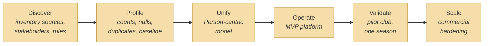

# Value Stream

_[← Strategy layer](./README.md) · [EA home](../README.md)_

**ArchiMate elements:** Value Stream, Value Stream Stage.

## Deliver a trustworthy multiclub football administration platform

Six stages, matching the project's roadmap phases. Each stage names the
capabilities ([2_capabilities-and-resources.md](./2_capabilities-and-resources.md))
it exercises.

| Stage | Delivers | Capabilities exercised |
| ----- | -------- | ------------------------ |
| **Discover** | Source inventory, stakeholder map, current processes, fee schedules, per-season rules, official source of record per data item | C9 |
| **Profile** | Row counts, null/duplicate rates, season-over-season comparison, payment and referee analysis, a quality baseline | C6, C9 |
| **Unify** | The Person-centric model: identity, roles, seasons, registrations, payments, documents, referees, matches, appointments, history | C1, C2, C4 |
| **Operate** | The MVP platform itself: portal, auth, multitenancy, registration, documents, finance, referee management, dashboards, transactional email, audit | C1–C8, C10 |
| **Validate** | A controlled pilot on one club and one season (or controlled group), compared against the club's prior process, with time and error measurements and feedback incorporated | C2–C9 |
| **Scale** | Hardening, backups, monitoring, privacy/security review, contracts, pricing, onboarding, support material — the transition to a commercial, multi-club product | C10 |

**Target:** the platform is live for the pilot club (Operate → Validate
complete) before the end of Q4 2026 (Goal G6,
[1_motivation.md](./1_motivation.md)); Scale follows once the pilot
validates the approach.
