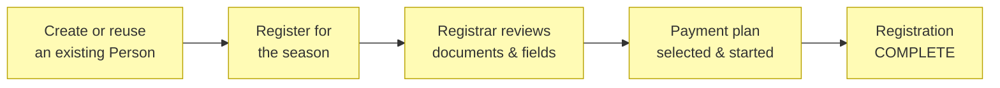
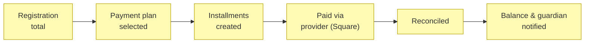
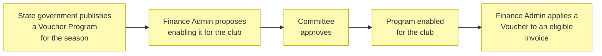
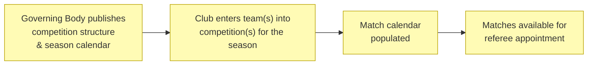
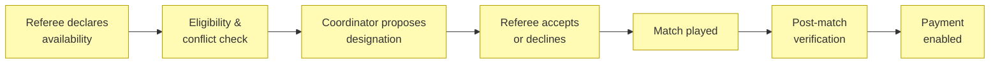
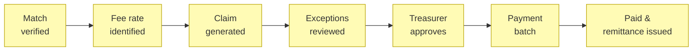
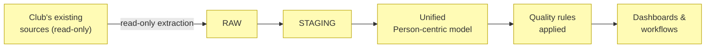

# Business Processes

_[← Business layer](./README.md) · [EA home](../README.md)_

**ArchiMate elements:** Business Process.

Each process below realizes the business service of the same theme in
[2_business-services.md](./2_business-services.md). All are
**Pending — future initiative** (see that document's note on grounding).

## Player registration process

Registration status moves through:
`DRAFT → SUBMITTED → UNDER_REVIEW → (MISSING_INFORMATION | PENDING_PAYMENT
| PENDING_DOCUMENTS | PENDING_EXTERNAL_REGISTRATION) → COMPLETE`, with
`REJECTED`, `WITHDRAWN`, and `CANCELLED` as terminal exits. The Compliance
& data quality service (deterministic rules,
[2_business-services.md](./2_business-services.md)) evaluates every
transition; the Assistant may draft an explanation of what's missing but
never changes the status itself (Principle P3).

## Payment plan process

## Voucher program enablement process

A Voucher Program (see
[4_business-objects.md](./4_business-objects.md#player-registration--finance))
only becomes available to reduce a family's invoice once the club's
Committee approves it — a Club governance decision, the same concern
already held by the **Committee Member** role
([1_business-actors-and-roles.md](./1_business-actors-and-roles.md)). A
program the Committee has not (yet) approved is simply unavailable; it
does not block or change any registration or payment plan already in
progress (BR21,
[5_domain-context-and-rules.md](./5_domain-context-and-rules.md)). New
Zealand has no equivalent nationwide government voucher; comparable
alternative funding (Tū Manawa Active Aotearoa, local council grants,
gaming/philanthropic trusts) runs through the existing Grants Committee
Member / Grants Coordinator roles instead of this process.

## Season competition setup process

The Governing Body / Association publishes competition structure (tiers,
format) and the season calendar for its jurisdiction — read-only, like
every other external source (Principle P2,
[1_strategy/1_motivation.md](../1_strategy/README.md)). Until a live feed
per association is confirmed (see
[open question #19](../../scope/open-questions.md)), entry is manual or
CSV-based, the same pattern as SQUADI/PlayFootball. This process is what
populates the Match objects the Referee appointment process below
designates referees to.

## Referee appointment process

A designation can only be proposed against a Match already in the club's
Competition Calendar (see [Season competition setup
process](#season-competition-setup-process) above, and BR20 in
[5_domain-context-and-rules.md](./5_domain-context-and-rules.md)).
Eligibility/conflict checks (deterministic, before any designation is
proposed) block on: the referee playing in one of the two teams, a second
simultaneous designation, insufficient classification, an active
suspension, or an expired mandatory accreditation. They warn (but don't
block) on: same-club affiliation, a family relationship with a participant,
limited travel time between matches, and excessive consecutive matches.
Every exception is audited. See
[5_domain-context-and-rules.md](./5_domain-context-and-rules.md) for the
full rule table.

## Referee payment process

## Historical data consolidation process

The extraction account is granted `SELECT`/`READ` only — never
`INSERT`/`UPDATE`/`DELETE`/`DROP`/`ALTER` — for the pilot club's source
systems (Principle P2,
[1_strategy/1_motivation.md](../1_strategy/README.md)).
