# Business Processes

_[← Business layer](./README.md) · [EA home](../README.md)_

**ArchiMate elements:** Business Process.

Each process below realizes the business service of the same theme in
[2_business-services.md](./2_business-services.md). All are
**Pending — future initiative** (see that document's note on grounding).

## Player registration process

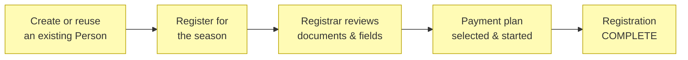

Registration status moves through:
`DRAFT → SUBMITTED → UNDER_REVIEW → (MISSING_INFORMATION | PENDING_PAYMENT
| PENDING_DOCUMENTS | PENDING_EXTERNAL_REGISTRATION) → COMPLETE`, with
`REJECTED`, `WITHDRAWN`, and `CANCELLED` as terminal exits. The Compliance
& data quality service (deterministic rules,
[2_business-services.md](./2_business-services.md)) evaluates every
transition; the Assistant may draft an explanation of what's missing but
never changes the status itself (Principle P3).

**`PENDING_EXTERNAL_REGISTRATION` is an eligibility gate, not a waiting
room.** Under Football Queensland policy a Player who is not registered in
SQUADI cannot take the field (BR43), so a registration parked in this
status costs playing time, not just tidiness. It is also where the
measured baseline is spent: registration currently takes **weeks**, and
the stakeholder-stated cause is SQUADI's own usability rather than any
step the club controls
([1_strategy/1_motivation.md](../1_strategy/1_motivation.md)). Stage 1 of
the [staged registration
ladder](../1_strategy/2_capabilities-and-resources.md) targets exactly
this: collect once, validate deterministically, and hand SQUADI a
submission that is right the first time — reducing the loop, without
needing an API. How much of the delay that can remove depends on
decomposing the baseline
([open question #32](../../scope/open-questions.md)). `PENDING_EXTERNAL_REGISTRATION`
is exactly the [International transfer clearance
process](#international-transfer-clearance-process) below — a Player whose
immediately preceding registration was overseas (BR35–BR38).

## International transfer clearance process

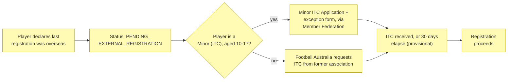

Triggered by the same self-registration questionnaire already used for
SQUADI/PlayFootball-sourced data ([open question
#7](../../scope/open-questions.md), resolved) asking whether the Player's
last registration was with an Affiliated club in Australia. A "no" answer
moves the Player Registration to `PENDING_EXTERNAL_REGISTRATION` (BR35).
**Only Football Australia may request the ITC** from the Player's former
national association (BR38) — a Club or Member Federation cannot request
one directly, they submit through it. The registration stays blocked
until the ITC is received, or until 30 days have elapsed since Football
Australia sent the request with no response, at which point provisional
registration is permitted (BR36). A Player who is a Minor (ITC) — aged
10–17 — additionally needs a Minor ITC Application matching one of FIFA's
exception categories (parents relocating for non-football reasons, five
years' continuous residence, academic exchange, or refugee status), with
supporting documentation submitted via the Member Federation; a Minor
under 10 is exempt from the whole process (BR37). See
[4_business-objects.md](./4_business-objects.md#international-transfers)
for the ITC and Minor ITC Application objects, and
[5_domain-context-and-rules.md](./5_domain-context-and-rules.md) for
BR35–BR38.

## Payment plan process

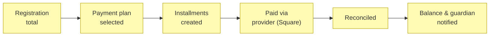

A plan is agreed against a registration's total, and the instalments it
generates sum to **exactly** that total (BR74) — the odd cents of an
uneven split land on the first instalment, so the last one stays the round
number a family expects. A registration carries **one** live plan (BR75),
and the schedule must finish inside the season being registered for
(BR76): a plan that outlives its season is a write-off scheduled in
advance, because the club is chasing money for a child who has stopped
playing.

**This process changes what BR3 means.** The rule blocks a registration
while payment is *in arrears* — an instalment past its due date and unpaid
— and not while a balance merely exists. Without the restatement a plan
would be worthless: a club could offer instalments and the child still
could not play, because the balance the plan exists to spread would itself
be the blocker. Where no plan has been agreed the whole amount is due and
BR3 is unchanged. An instalment due *today* is not yet late.

Money received is recorded, never edited (BR77). A refund or a correction
is a reversing entry naming what it reverses, so the club's answer to "what
did we say we received, and when" survives the correction. Payments are
allocated to instalments **oldest first**, at read time and without being
stored: a family paying $50 against a $40 instalment has made no statement
about allocation, and recording a guess as though they had turns
arithmetic into a disputed fact.

Agreeing, changing or cancelling a plan, and recording a payment, are
Finance Admin or Treasurer acts (BR78) — the separation BR22 already draws
for vouchers. Reading is open to every club member, because a Registrar
chasing BR3 has to be able to see why a registration is blocked.

Reconciliation against the provider (Square) and guardian notification are
**not yet built**: what exists records what the club charged and what it
received, which is the part the club's own books depend on whether or not
an integration ever arrives.

## Voucher program enablement process

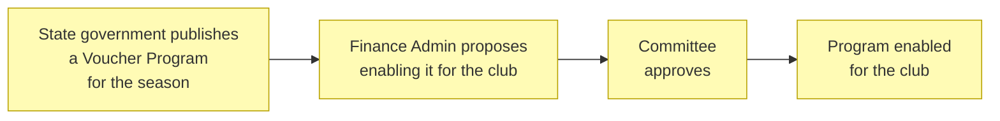

A Voucher Program (see
[4_business-objects.md](./4_business-objects.md#player-registration--finance))
only becomes available to reduce a family's invoice once the club's
Committee approves it — a Club governance decision, the same concern
already held by the **Committee Member** role
([1_business-actors-and-roles.md](./1_business-actors-and-roles.md)). A
program the Committee has not (yet) approved is simply unavailable; it
does not block or change any registration or payment plan already in
progress (BR21,
[5_domain-context-and-rules.md](./5_domain-context-and-rules.md)). New
Zealand has no equivalent nationwide government voucher; comparable
alternative funding (Tū Manawa Active Aotearoa, local council grants,
gaming/philanthropic trusts) runs through the existing Grants Committee
Member / Grants Coordinator roles instead of this process. Once a
program is enabled, applying a specific Voucher to a specific Player's
invoice, and claiming its value back from government, is the [Voucher
application and claim process](#voucher-application-and-claim-process)
below.

## Voucher application and claim process

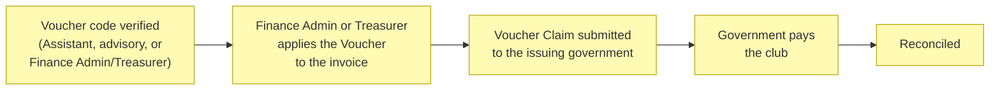

A Voucher can only be applied once its code is verified (BR25) against
the issuing government's own public verification interface and the
result recorded — the Assistant (AI actor) may perform this check and
surface the result, but it is advisory only; it never decides whether the
Voucher is applied (Principle P3, decision
[2](../../decisions/2_ai-voucher-code-verification.md)). Only Finance
Admin or Treasurer may then generate the Voucher's application to the
invoice (BR22) — separating the Committee's program-level approval
([Voucher program enablement process](#voucher-program-enablement-process),
BR21) from who actually executes it financially. Applying a Voucher
creates a Voucher Claim the club submits to the issuing government for
reimbursement, through that program's own CSV/portal mechanism — no state
program currently exposes a general claims API at the pilot club's scale
(see the voucher-program claim mechanisms resource in
[1_strategy/2_capabilities-and-resources.md](../1_strategy/2_capabilities-and-resources.md)).
BR23 and BR24 prevent claiming a Voucher that was never applied, or
claiming the same Voucher twice.

## Season competition setup process

The Governing Body / Association publishes competition structure (tiers,
format), its Competition Regulations and Playing Formats, and the season
calendar for its jurisdiction — read-only, like
every other external source (Principle P2,
[1_strategy/1_motivation.md](../1_strategy/README.md)). Until a live feed
per association is confirmed (see
[open question #19](../../scope/open-questions.md)), entry is manual or
CSV-based, the same pattern as SQUADI/PlayFootball. This process is what
populates the Match objects the Referee appointment process below
designates referees to.

## Referee appointment process

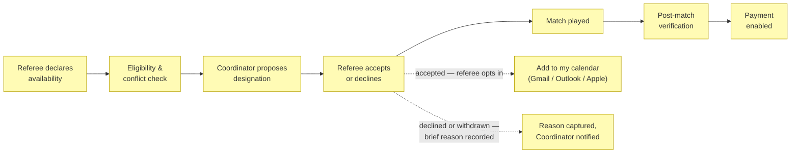

A designation can only be proposed against a Match already in the club's
Competition Calendar (see [Season competition setup
process](#season-competition-setup-process) above, and BR20 in
[5_domain-context-and-rules.md](./5_domain-context-and-rules.md)).
Eligibility/conflict checks (deterministic, before any designation is
proposed) block on: the referee playing in one of the two teams, a second
simultaneous designation, insufficient classification, an active
suspension, or an expired mandatory accreditation. They warn (but don't
block) on: same-club affiliation, a family relationship with a participant,
limited travel time between matches, and excessive consecutive matches.
Every exception is audited. See
[5_domain-context-and-rules.md](./5_domain-context-and-rules.md) for the
full rule table.

**Responding to a designation.** Declining, or withdrawing from a
designation already accepted, requires a brief recorded reason (BR42) —
withdrawal additionally notifies the Referee Coordinator, since a match
already counted as covered has just become uncovered. The reason gives
BR12's decline-rate threshold the context a bare count lacks. On
**acceptance**, the referee is offered the option to add the fixture to
their own calendar (see the [Calendar subscription
process](#calendar-subscription-process) below); if they later withdraw,
removing the entry from their personal calendar is their own
responsibility — the platform never reaches into it (BR34).

## Calendar subscription process

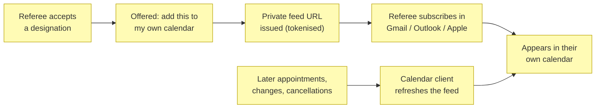

Calendar sync is offered **at the point a referee accepts a designation**
(stakeholder confirmation, July 2026) — the moment the commitment becomes
real — rather than as a setting buried elsewhere. Accepting the offer
issues a private, unguessable feed URL they paste into whichever calendar
they already use; Google/Gmail, Outlook/Microsoft 365, and Apple Calendar
all subscribe to the same standards-based iCalendar feed, and every
subsequent appointment flows through it without repeating the setup.
**The calendar client pulls; Let'sDataTalk never holds a credential for, or
writes into, anyone's personal calendar account** — so Principle P2 holds
with no exception (decision
[4](../../decisions/4_calendar-distribution-by-feed-not-account-access.md)).

A feed carries only that one Person's own appointments (BR30) and only
non-personal match detail — competition, date/time, venue, and their own
role — never another participant's personal data (BR32). The URL is a
bearer credential, so it is revocable and rotatable on demand (BR31), and
for a minor referee (MiniRef, Club Based Match Official) it is issued to
the Guardian, consistent with the duty-of-care pattern in BR1 (BR33).

The feed is a **convenience copy, never the source of truth**: the
platform's own appointment record remains authoritative for eligibility,
conflict checks (BR6–BR11), and payment (BR13) — a referee deleting an
event from their personal calendar does not decline the designation
([Referee appointment process](#referee-appointment-process)). The
converse holds too, and is the referee's own responsibility: withdrawing
from an accepted designation in the platform (with its reason, BR42) does
not reach into their personal calendar to remove the entry.

## Referee payment process

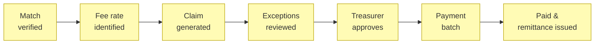

## Carnival event lifecycle process

```mermaid
flowchart LR
  create["Events Coordinator<br>creates the event"]:::business
  configure["Carnival Conditions<br>configured"]:::business
  enter["Clubs enter<br>teams"]:::business
  draw["Draw/fixtures<br>generated"]:::business
  officiate["Match officials<br>appointed"]:::business
  play["Fixtures<br>played"]:::business
  record["Results & ladder<br>recorded"]:::business
  publish["Public Event View<br>published"]:::business

  create --> configure --> enter --> draw --> officiate --> play --> record --> publish

  classDef business fill:#fffbb5,stroke:#b8a200,color:#333
```

A Carnival/Grassroots Event is created and owned by an **Events
Coordinator** at the hosting club or Governing Body (not a season
Competition, and not tied to a single tenant — see
[4_business-objects.md](./4_business-objects.md#carnivals--grassroots-events)).
Its responsible person — the same Events Coordinator, whether or not they
also hold Registrar or Secretary — is the only one who may configure or
later change its Carnival Conditions (points system/tie-breakers, match
format, eligibility, code of conduct, and the BR26 public-names opt-in)
(BR29,
[5_domain-context-and-rules.md](./5_domain-context-and-rules.md#business-rules)).
Match officials (Referee, Assistant Referee, Club Based Match Official,
MiniRef) appointed to a Carnival Fixture go through the same eligibility
and conflict checks as a season match (BR6–BR11, BR28). As results come
in, the ladder/standings recompute from the Carnival Conditions' points
system for round-robin-format events. Once the Events Coordinator
publishes, the event's Public Event View — fixture schedule and draw
(date, time, venue), each team's next fixture, the ladder, and results —
becomes visible to unauthenticated visitors across every participating
club (Principle P6, BR27) — but shows club/team-level information only;
individual player names are never published unless the Events Coordinator
explicitly opts the event in as adult/open-age (BR26). Coaches, Team
Managers, Parents/Guardians, and Players who already have an account can
also just use it as usual; the public view exists for visitors who don't
([1_business-actors-and-roles.md](./1_business-actors-and-roles.md#public-actor)).

## External registration reconciliation process

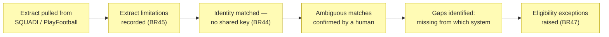

This is the modeled form of what clubs do manually today — Majestri's
"Run Squadi Comparison" and "Run PlayFootball v2.0 Comparison" buttons,
executed by a Registrar or Majestri administrator every few weeks. On
the pilot club's own 2026 screen: 799 players, 707 registrations, 49
incomplete; 78 missing from PlayFootball v2.0 and 40 missing from
SQUADI, both comparisons last run 15 May 2026.

Three things make this harder than a join, and each is a rule rather
than an implementation detail:

- **There is no shared key.** The Squadi User Report lost its FA ID
  column in March 2025, so matching falls back to name + date of birth +
  email, and every uncertain result is a candidate a human confirms
  (BR44). A false merge attaches one child's registration, payments, and
  eligibility to another.
- **Each extract lies by omission, differently.** The Registration
  Report drops `De-Registered` rows and carries no role; the User Report
  covers only Player/Coach/Team Official, has no registration date, and
  may span more than one season. "Missing from SQUADI" therefore means
  something different depending on which report produced it, so the
  limitations travel with the data (BR45) and qualify the result.
- **A gap is a person who cannot play.** Under BR43 a Player absent from
  SQUADI is ineligible, so the output is an eligibility exception with a
  named consequence, not a spreadsheet row (BR47) — and it is dated,
  because a ten-week-old comparison is a snapshot people are still acting
  on (BR46).

Reconciliation is read-only against every external system (Principle P2):
the platform compares and reports, and a human resolves each exception in
whichever system owns it — SQUADI remains authoritative where the two
disagree (BR39).

## Consent and erasure process

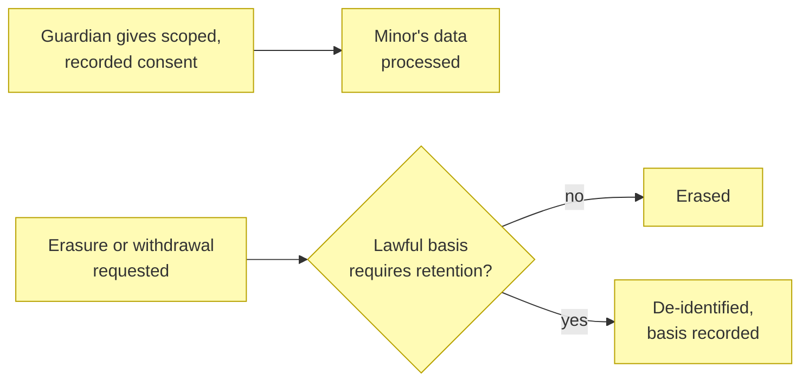

A minor's data is processed only under explicit guardian consent that
records **what**, **by whom**, and **when**, and that the guardian may
withdraw per purpose (BR48). Guardianship (BR1) establishes who is
responsible; it is not itself consent.

Erasure is deliberately **not absolute** (BR49). A request is honoured
unless a named lawful basis requires retention — statutory financial or
child-safety minimums, an active eligibility record (BR43), or audit
integrity — and where the obligation can be met without keeping an
identifiable record, the data is **de-identified rather than deleted**.
Every refusal or partial refusal records the specific basis relied on,
which is what makes the decision defensible later.

Which framework governs any of this is per tenant, not platform-wide
(BR52): Australia's Privacy Act and APPs, New Zealand's Privacy Act 2020,
and the GDPR differ — notably, **neither the APPs nor New Zealand's Act
contains a general right to erasure**, so this process implements a
standard higher than AU/NZ law currently requires (see
[open question #36](../../scope/open-questions.md)).

## WWCC clearance lifecycle process

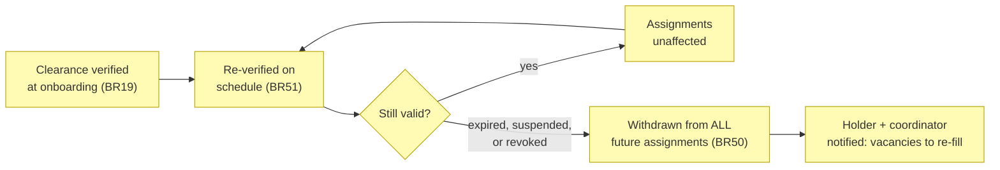

This closes a gap the earlier rules left open between them. BR19 checks a
clearance **before** someone starts; BR10 blocks a **new** designation —
but neither removes a person already on next Saturday's match sheet when
their card lapses on Tuesday. Point-in-time verification is not
safeguarding.

So the check recurs (BR51) — state registers can suspend or revoke
mid-term, which an onboarding-only check would never see — and a
transition out of *valid* **automatically withdraws the holder from every
future assignment**: match official appointments, carnival fixtures, and
any other child-related role (BR50). Past assignments are left intact as
historical record.

Withdrawal creates a second problem the process must own rather than
ignore: those fixtures are now **uncovered**. Both the holder and the
responsible coordinator (Referee Coordinator, or the Events Coordinator
for a carnival) are notified so the vacancies can be re-filled — an
automatic unassignment that nobody is told about would trade a
safeguarding failure for an operational one.

## Historical data consolidation process

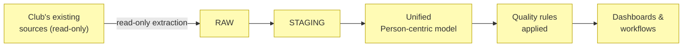

The extraction account is granted `SELECT`/`READ` only — never
`INSERT`/`UPDATE`/`DELETE`/`DROP`/`ALTER` — for the pilot club's source
systems (Principle P2,
[1_strategy/1_motivation.md](../1_strategy/README.md)).
