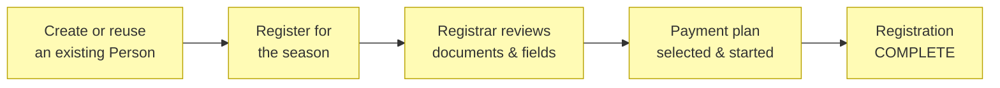
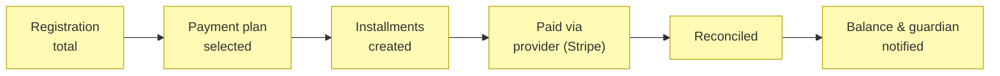
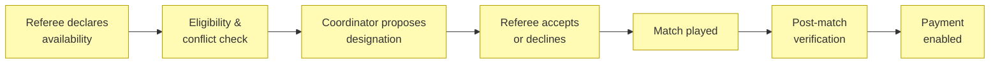
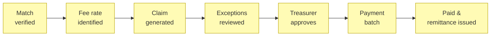
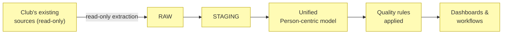

# Business Processes

_[← Business layer](./README.md) · [EA home](../README.md)_

**ArchiMate elements:** Business Process.

Each process below realizes the business service of the same theme in
[2_business-services.md](./2_business-services.md). All are
**Pending — future initiative** (see that document's note on grounding).

## Player registration process

Registration status moves through:
`DRAFT → SUBMITTED → UNDER_REVIEW → (MISSING_INFORMATION | PENDING_PAYMENT
| PENDING_DOCUMENTS | PENDING_EXTERNAL_REGISTRATION) → COMPLETE`, with
`REJECTED`, `WITHDRAWN`, and `CANCELLED` as terminal exits. The Compliance
& data quality service (deterministic rules,
[2_business-services.md](./2_business-services.md)) evaluates every
transition; the Assistant may draft an explanation of what's missing but
never changes the status itself (Principle P3).

## Payment plan process

## Referee appointment process

Eligibility/conflict checks (deterministic, before any designation is
proposed) block on: the referee playing in one of the two teams, a second
simultaneous designation, insufficient classification, an active
suspension, or an expired mandatory accreditation. They warn (but don't
block) on: same-club affiliation, a family relationship with a participant,
limited travel time between matches, and excessive consecutive matches.
Every exception is audited. See
[5_domain-context-and-rules.md](./5_domain-context-and-rules.md) for the
full rule table.

## Referee payment process

## Historical data consolidation process

The extraction account is granted `SELECT`/`READ` only — never
`INSERT`/`UPDATE`/`DELETE`/`DROP`/`ALTER` — for the pilot club's source
systems (Principle P2,
[1_strategy/1_motivation.md](../1_strategy/README.md)).
