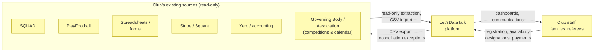

# Domain Context and Rules

_[← Business layer](./README.md) · [EA home](../README.md)_

**ArchiMate elements:** none new — this document carries the problem
statement, system context, glossary, and business rules that bind the
elements defined elsewhere in this layer.

## Problem statement

Clubs in Australia and New Zealand run player and referee administration
across disconnected tools — cloud databases, spreadsheets, forms, SQUADI,
PlayFootball, email, WhatsApp, Google Drive, Stripe, Square, Xero, CSVs,
and PDFs — with no official API available for SQUADI or Football Australia.
This produces duplicated identities, registrations no one can confirm are
complete, fragmented finance and referee tracking, and heavy manual
reconciliation. Let'sDataTalk consolidates this into one multitenant,
`Person`-centered platform without requiring the external systems to change
first (Principle P2,
[1_strategy/1_motivation.md](../1_strategy/README.md)).

## System context

## Glossary

Canonical English terms; reuse these in code, commits, and future
documents rather than re-deriving translations from the Spanish discovery
material.

| Term | Meaning |
| ---- | ------- |
| **Person** | The single identity a human has in the system, independent of role (Principle P1) |
| **Person Role** | A time-bounded role a Person holds at a club, for a season |
| **Tenant / Club** | The unit of logical data separation in the multitenant platform |
| **Registration** | A Player's season-scoped enrollment record |
| **Guardian** | The Parent/Guardian responsible for a minor Player |
| **Classification** | A referee's current standing on the Football Queensland pathway (e.g. MiniRefs 5.0, Club Based Match Official 4.5, …) |
| **Pathway** | The progressive structure of referee classifications and promotion routes |
| **Availability** | A referee's declared window of matches they can be designated to |
| **Designation / Appointment** | The assignment of a referee (or Assistant Referee, Fourth Official, …) to a specific match |
| **Decline rate** | The proportion of designations a referee declines, subject to a classification/competition-specific maximum |
| **Governing Body / Association** | The external football association per state/region that defines competition structure and publishes the season calendar (Football Queensland, Football NSW, Northern NSW Football, Capital Football, Football South Australia, Football West, New Zealand Football, …) |
| **Competition** | A named league or cup run by a Governing Body for a season, with a type, format, and tier — see [4_business-objects.md](./4_business-objects.md#competitions--calendar) |
| **Competition Format** | How a Competition's rounds are structured: Knock Out, Round Robin, Double Round Robin, or Enhanced Round Robin (Fixed Number of Rounds or Full Rounds Only) |
| **Match** | A single fixture within a Competition, on the Competition Calendar, that a referee can be designated to and paid for |
| **Claim** | A referee's request for payment for a verified match |
| **Remittance** | The record of a referee payment batch actually paid out |
| **Voucher** | A discount instrument applied to an invoice, including the PlayOn Sports Voucher |
| **RAW / STAGING / Unified model** | The three stages historical data passes through during consolidation (see [3_business-processes.md](./3_business-processes.md#historical-data-consolidation-process)) |
| **Working with Children Check (WWCC)** | A mandatory clearance for adults working with children in child-related sectors; state-specific in Australia (e.g. Queensland's Blue Card), verified in real time through state government online portals using the worker's clearance number, surname, and date of birth. New Zealand's equivalent is unconfirmed (open question 14, [docs/scope/open-questions.md](../../scope/open-questions.md)) |
| **Appointing party** | Whichever body designates a referee to a match — the club itself, or an association/competition body (e.g. Football Queensland) — determines who is financially responsible for that designation (see BR16) |

## Business rules

Every rule the Compliance & data quality service (deterministic layer,
[2_business-services.md](./2_business-services.md)) evaluates. New rules
get a row here, with rationale, before they get code (`ea-first-change`).

| # | Rule | Applies to | Rationale / source |
| - | ---- | ---------- | --------------------- |
| BR1 | A minor's registration cannot be COMPLETE without an associated Guardian | Player registration | Duty of care; a minor cannot be the sole responsible party |
| BR2 | A registration cannot be COMPLETE with a required document missing | Player registration | Compliance and eligibility depend on document completeness |
| BR3 | A registration cannot be COMPLETE with an outstanding payment | Player registration / finance | Financial control |
| BR4 | A voucher cannot be applied to more than one invoice | Player finance | Prevents double-discounting (e.g. PlayOn Sports Voucher duplication) |
| BR5 | Two Person records with matching strong identifiers (name + date of birth, or external ID) are flagged as a possible duplicate, not silently merged | Identity | Merging identities is a human decision; false merges are costly to undo |
| BR6 | A referee cannot be designated to a match they are also registered as a Player in | Referee appointment | Blocking conflict — direct role conflict in the same match |
| BR7 | A referee cannot hold two simultaneous designations | Referee appointment | Blocking conflict — a person cannot officiate two matches at once |
| BR8 | A referee's classification must meet or exceed the competition's minimum for the designation to be valid | Referee appointment | Blocking conflict — competency requirement |
| BR9 | A referee with an active suspension cannot be designated | Referee appointment | Blocking conflict — disciplinary status |
| BR10 | A referee with an expired mandatory accreditation cannot be designated | Referee appointment | Blocking conflict — compliance requirement |
| BR11 | Same-club affiliation, a family relationship with a participant, limited travel time, or excessive consecutive matches produce a warning, not a block, and every override is audited | Referee appointment | Judgment calls that a human coordinator should see, not calls the system should make unilaterally |
| BR12 | A referee's decline rate over the configured window must not exceed the classification/competition's configured maximum | Referee compliance | Configurable per classification/competition, not hardcoded (see Football Queensland pathway rules) |
| BR13 | A referee payment claim requires a verified match before it can be created | Referee finance | Prevents paying for unverified/undisputed matches |
| BR14 | A referee cannot be paid twice for the same verified match | Referee finance | Prevents duplicate payment |
| BR15 | The AI Assistant's output on any of the above never itself changes a status, approves a document, or executes a payment — only a human role does | Cross-cutting | Principle P3; see [1_business-actors-and-roles.md](./1_business-actors-and-roles.md#ai-actor) |
| BR16 | The appointing party pays the referee: the club pays when the club made the designation; an association or government entity (e.g. Football Queensland) pays when it made the appointment | Referee finance | Stakeholder confirmation (see [docs/scope/open-questions.md](../../scope/open-questions.md)) |
| BR17 | No referee payment claim is generated for a cancelled match | Referee finance | Stakeholder confirmation — no service was delivered, so no payment is owed |
| BR18 | A referee payment claim for an abandoned match requires the referee's explanation of the reason for abandonment before it can be approved | Referee finance | Stakeholder confirmation — payment eligibility depends on why the match was abandoned |
| BR19 | A paid or volunteer worker in a child-related role must hold a current Working with Children Check (state-specific, e.g. Queensland's "no card, no start" Blue Card requirement) before starting, verified through the relevant state government portal | Identity / compliance | Legal requirement in Australia; duty of care (see the **Blue Card Administration** actor, [1_business-actors-and-roles.md](./1_business-actors-and-roles.md)) |
| BR20 | A Match Official Appointment must reference a Match that exists in the club's Competition Calendar for the current Season | Referee appointment | Closes the gap between "Match played" ([3_business-processes.md](./3_business-processes.md#referee-appointment-process)) and where a Match actually comes from ([Season competition setup process](./3_business-processes.md#season-competition-setup-process)) — an appointment cannot be proposed for a fixture that was never entered/published |

Rule parameters that vary by classification, competition, association, or
season (availability weeks, decline-rate thresholds, confirmation/verification
hour limits, fee schedules, competition classification minimums) are
**configuration data, not code** — see
[1_strategy/2_capabilities-and-resources.md](../1_strategy/README.md)'s
note on the Football Queensland pathway resource and the competitions-per-state
resource, and
[docs/scope/open-questions.md](../../scope/open-questions.md) for the ones
whose actual values are still unconfirmed.
