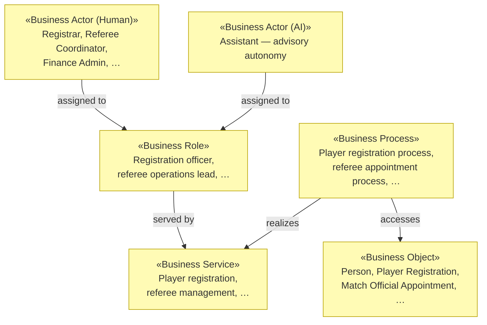

# Business Layer

_[← EA home](../README.md)_

Who interacts with the system, the services it offers them, the processes
those services run through, the business objects they handle, and the
domain vocabulary and rules that constrain all of it.

## Analysis order

Files are numbered in the order they are analyzed: identify _who_ first,
then _what they are offered_, then _how it is delivered_, then _what is
handled_, and finally the domain vocabulary and rules.

| #   | Document                                                          | Elements                                           | Question it answers                              |
| --- | -------------------------------------------------------------------| ---------------------------------------------------- | --------------------------------------------------- |
| 1   | [1_business-actors-and-roles.md](./1_business-actors-and-roles.md) | Business Actors and Roles                          | Who interacts with the system?                    |
| 2   | [2_business-services.md](./2_business-services.md)                | Business Services                                  | What is offered to them?                          |
| 3   | [3_business-processes.md](./3_business-processes.md)              | Business Processes                                 | How are those services delivered?                 |
| 4   | [4_business-objects.md](./4_business-objects.md)                  | Business Objects                                   | What things do the processes handle?              |
| 5   | [5_domain-context-and-rules.md](./5_domain-context-and-rules.md)  | Problem statement, system context, glossary, rules | What vocabulary and constraints bind everything?  |

`5_domain-context-and-rules.md` carries the project's **glossary** (reuse
its terms in code and commits) and its **business rules table** — every new
rule gets a row there, with its rationale, before it gets a line of code.
It is also the natural home for a role × operation access matrix if the
project has segregated roles.

`1_business-actors-and-roles.md` states each actor's **kind** — human, AI,
or hybrid — and, for AI/hybrid actors, its autonomy level, decision
rights, and escalation path (see the `ea-doc-style` skill's actor
notation). This is where an AI system's role **in the business being
modeled** gets stated explicitly — not just its role in how this repo is
developed (see `CONTRIBUTING.md`). If an initiative changes one of those
values, consider a `decision-record` alongside the scope document.

## Layer view

See [1_business-actors-and-roles.md](./1_business-actors-and-roles.md) for
the full actor/role table (46 human roles, the AI Assistant, and the
external Governing Body / Association actor),
[2_business-services.md](./2_business-services.md) for all thirteen
services, and [4_business-objects.md](./4_business-objects.md) for the
full object inventory.

Every business service is realized by application services — the mapping is
in [4_application/1_application-services.md](../4_application/1_application-services.md).
