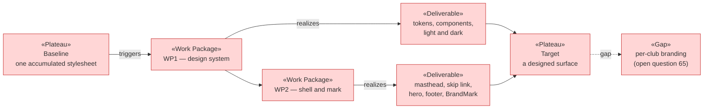

# Project Scope — The Interface, and the Southern Ocean Palette

_[← Scope index](./README.md) · [EA home](../ea/README.md)_

**ArchiMate viewpoint:** Implementation & Migration.
**Delivered as:** branch `diseno-ux`.

Thirty screens had been built and none of them had been *designed*. The
stylesheet that carried all of them was written alongside the first three
pages of the registration slice and never revisited: a default blue accent,
one flat neutral grey, a single shadow, and a hex typed in wherever a new
screen needed a colour the file did not already have. It was not broken —
it was **unowned**, and an unowned stylesheet is the thing that decides what
a product looks like by accumulation. This initiative gives it a system and
a palette, and gives the platform a mark, without adding a framework, a
build step, or a dependency.

The palette is the part with an argument behind it. **Green and gold is what
football looks like in Australia** — the wattle the national sporting
colours are named for, worn by the Socceroos and the Matildas — and it is a
palette this product can wear in the *other* market it claims, because New
Zealand's football identity is black and white (the All Whites) and sits
under green and gold without competing with it. The informational blue is
the Tasman between the two; the warning ochre is the inland. A blue accent
inherited from a framework default said nothing about football and nothing
about where this platform operates.

## The two rules that make it a palette rather than a costume

1. **Green carries weight, gold carries attention.** Wattle gold on white
   is roughly 1.6:1 — unreadable as text and useless as a focus ring. So
   gold is never a text colour on a light surface and never the only thing
   marking a state: it is the rail across each figure tile, the hero's
   pitch markings, the ring in the mark, and the halo around a focused
   control whose actual ring is green. Everything that must be *read* is
   deep eucalyptus green. Every foreground/background pair in the token set
   was measured; all clear WCAG AA at 4.5:1 except `--subtle`, which was
   moved from `#78877f` to `#607068` for exactly that reason.
2. **No state is signalled by hue alone.** Every status pill now carries a
   dot and a word as well as a colour (WCAG 1.4.1). Roughly one registrar
   in twelve cannot tell this green from this red, and the thing being
   marked is whether a child may take the field.

## EA alignment (assessed top-down before implementing)

| Layer         | Impact                                                                                                                                                                                                                                                                                                                                                                                                                                                                                             |
| ------------- | --------------------------------------------------------------------------------------------------------------------------------------------------------------------------------------------------------------------------------------------------------------------------------------------------------------------------------------------------------------------------------------------------------------------------------------------------------------------------------------------------- |
| 1_strategy    | **No change.** No new stakeholder, driver, goal, or principle. It serves **G2** (a family can see immediately what is missing) and **G6** (a pilot the club's families will actually complete) by making those screens legible, and contradicts none of P1–P7. A palette is not a goal, and inventing one to justify a stylesheet would be worse documentation than none.                                                                                                                             |
| 2_business    | **No change.** No business rule added, none amended, no glossary term, no actor, no autonomy level touched. One existing rule was **preserved deliberately rather than inherited**: the demonstration club and a real club are styled apart (scope 13, scope 28) because mistaking real children's records for fictional ones is the error that costs something. That distinction is re-drawn in the new palette — ochre for the demo, brand green for the real club — rather than surviving by luck. |
| 3_information | **No change.** No data object, flow, representation, classification, or retention is affected. Nothing here reads or writes anything.                                                                                                                                                                                                                                                                                                                                                               |
| 4_application | Two components, both new rows in [2_application-components.md](../ea/4_application/2_application-components.md): the **interface design system** (`src/app/globals.css`) and the **application shell and landing page** (`src/app/layout.tsx`, `src/app/page.tsx`, `src/app/_components/BrandMark.tsx`). The **no club branding** gap on *Multitenant platform operations* is narrowed and restated, not closed — see below.                                                                          |
| 5_technology  | **No change, and the no-change is the decision.** No CSS framework, no component library, no `next/font`, no new dependency, no new build step. `next/font` in particular was considered and refused: it fetches at build time, so a distinctive typeface would buy visual character at the price of a build that can fail because a font CDN is unreachable. The stack in [1_technology-services.md](../ea/5_technology/1_technology-services.md) is untouched.                                       |

## Plateaus

| Plateau                | State                                                                                                                                                                                                                                                                                                                                                             |
| ---------------------- | ------------------------------------------------------------------------------------------------------------------------------------------------------------------------------------------------------------------------------------------------------------------------------------------------------------------------------------------------------------- |
| **Baseline** (before)  | One 597-line stylesheet grown page by page. A generic `#0b5fff` accent. Four classes used in `.tsx` (`prose`, `mono`, `table-wrap`, `process-detail`) that **no rule ever defined** — five components rendering unstyled without anyone noticing. No focus treatment beyond a 2px outline, no reduced-motion handling, no print rules, no mark, no skip link. Ten navigation destinations wrapping onto four lines on a phone. |
| **Target** (delivered) | A token set — colour ramps, semantic aliases, space, radii, elevation, type, motion — with a light and a dark theme derived from it rather than hand-listed. Every class used in the app is defined. Status is dot-plus-word-plus-colour. A sticky masthead with a mark, a skip link, a hero that separates the family from the registrar, and a footer. The club menu is one scrolling rail below 45rem. Print drops the chrome. |

## Work packages and deliverables

### WP1 — The design system

- **Deliverables:** `src/app/globals.css`, rewritten. Colour ramps
  (eucalyptus, wattle, Tasman, ochre, red earth, neutrals) plus semantic
  aliases every rule consumes; space, radius, shadow, type and motion
  scales; a dark theme redefining only the tokens; the four previously
  undefined classes (`.prose`, `.mono`, `.table-wrap`, `.process-detail`)
  given rules; new `.hero`, `.card-grid`, `.card-link`, `.eyebrow`,
  `.button-row`, `.button.ghost`, `.button.destructive`, `.notice-ok`,
  `.notice-info`, `.skip-link`, `.brand-mark`, `.site-footer`; a single
  loud focus treatment on every interactive element; `:user-invalid`
  rather than `:invalid` so a form is not red before anything is typed;
  2.75rem minimum control height; `prefers-reduced-motion` and `@media
  print` blocks.
- **Outcome:** a screen is composed from decisions already made. The next
  page added to this application has a colour, a spacing and an elevation
  to reach for, and no reason to type a hex.

### WP2 — The shell, the mark, and the front door

- **Deliverables:** `src/app/_components/BrandMark.tsx` (new — an inline
  SVG football panel in green, gold and white); `src/app/layout.tsx` (a
  sticky masthead carrying the mark, a keyboard skip link to `#main`, a
  `viewport` export giving the browser chrome a theme colour per scheme, a
  metadata title template, and a footer); `src/app/page.tsx` (a hero and a
  three-card grid).
- **Outcome:** the platform has an identity, and the landing page separates
  its two audiences — a family with a child to register and an officer
  starting a shift — before either has to read a menu.

## In scope / out of scope

| In scope                                                                       | Out of scope (gaps, candidate future work)                                          |
| ------------------------------------------------------------------------------ | ----------------------------------------------------------------------------------- |
| A token-driven stylesheet, light and dark, replacing the accumulated one        | **Per-club branding** — a club's crest and colours on its own tenant (question 65)    |
| The AU/NZ palette, applied to every existing screen through their existing classes | **A CSS framework or component library** — deliberately still absent                |
| Status marked by dot + word + colour, not hue alone                            | **A documented WCAG conformance audit** — contrast was measured, nothing else was    |
| A brand mark, sticky masthead, skip link, hero, footer                         | **A web font** — refused with the build-time-fetch reasoning above                   |
| The club menu as a scrolling rail on narrow viewports                          | **A light/dark toggle** — the OS preference is honoured; there is no in-app override |
| Reduced-motion and print treatments                                            | **The mobile client (C17)** — untouched; this is the server-rendered web surface     |
| Definitions for the four classes the markup used and the stylesheet lacked     | **Any change to a screen's content, wording, or behaviour**                          |

## Gap notes

- **Per-club branding.** This is the gap the initiative is most likely to be
  mistaken for closing. The platform now has an identity; a *club* still has
  none, and on a multiclub product that is the branding a club will ask for
  first — its crest in the masthead, its colours on its own tenant. Closing
  it is mostly cheap: the token layer is already the seam (a club's palette
  would override a handful of semantic aliases on a wrapper element), and
  `club` would need a crest asset in a club-scoped bucket like the three
  that already exist. What is **not** cheap is the part that is not
  technical — a club's colours can collide with the demonstration marker or
  with the pass/blocked pills, and a club playing in red and green would
  make the two most load-bearing states on the queue screen ambiguous. Any
  per-club palette has to be a *restricted* one, and deciding what it may
  not do is the work. Raised as [question 65](./open-questions.md).
- **No conformance audit.** Contrast ratios were computed for every
  foreground/background pair in the token set, and the status pills no
  longer rely on hue. That is two WCAG criteria out of many. Nothing ran an
  automated accessibility check, no screen was tested with a screen reader,
  and there is no CI gate on any of it — so this is a stylesheet that was
  designed accessibly, not one that is *proven* accessible. The cheapest
  next step is an `axe-core` pass over the rendered screens in the same
  Playwright run that would produce visual regressions; the obstacle is
  that most screens need a signed-in Supabase session, which the check
  suite has no way to produce today.
- **No visual regression test.** `npm run check` proves the types, the
  rules, the links and the policies. Nothing proves a screen still looks
  right, so a token renamed in six months breaks a layout silently. The
  same authenticated-session problem gates it.
- **Screens verified in two states, not all of them.** The landing page was
  rendered in light, dark and at 390px; every other component was verified
  through a static gallery reproducing its markup. The authenticated
  screens themselves were not rendered, because they need a Supabase
  project this branch does not have.

## Open questions

- **[Question 65](./open-questions.md) — per-club branding.** Does a club
  get its own crest and colours on its tenant, and if so, what may a club's
  palette *not* override? The adopted interpretation for now is that the
  platform's identity is the only one, and every club sees the same green
  and gold. Applied in [`src/app/globals.css`](../../src/app/globals.css)
  and [`BrandMark.tsx`](../../src/app/_components/BrandMark.tsx).
