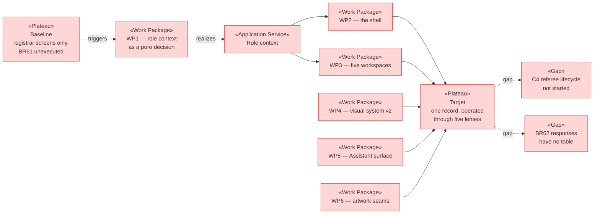

# Project Scope — The Role Context Shell, and a Second Palette

_[← Scope index](./README.md) · [EA home](../ea/README.md)_

**ArchiMate viewpoint:** Implementation & Migration.
**Delivered as:** branch `diseno-ux`, alongside
[scope 31](./31_the-interface-and-the-southern-ocean-palette.md), which it
supersedes. **Partially delivered** — WP1, WP4, WP5 and the seams of WP6 are
in; WP2 and WP3 are not, and the reason is in the gap notes.

**BR61 has been written down since the business layer was drafted and has
never once been executed.** "A Person holding several roles operates in one
active role context at a time" is the sentence that makes Principle P1
something a human *experiences* rather than something the schema merely
permits — and every screen built so far is a registrar's screen, addressed
to somebody doing one job. The volunteer the platform actually serves does
five: she plays, coaches her daughter's side, referees juniors, is her
son's guardian **at a different club**, and sits on the committee. Today the
application has nowhere to put her.

This initiative builds that place. It also replaces the visual layer scope
31 delivered, because the design that came back from review was legible and
correct and read as an admin tool from 2014 — and the shell being introduced
here is the first surface a family, rather than a registrar, will ever open.

Two things found during the EA walk are more important than the design, and
are the reason this document exists before any code:

1. **The conflict rule the design depends on does not exist.** BR6 refuses a
   referee who is a *Player* in that match. Nothing refuses a referee who is
   the *coach* of a side in it. The prototype shows that refusal as though
   it were already a rule; it is not, and it needs writing.
2. **Scope 31 refused a web font on purpose, and this direction wants one.**
   That is a reversal at the technology layer, not a styling preference, and
   it is unresolved below.

## EA alignment (assessed top-down before implementing)

| Layer         | Impact |
| ------------- | ------ |
| **1_strategy** | **No new goal, driver, stakeholder or principle.** It serves **G1** (one identity per person) more directly than any change so far: the single record stops being an invisible property of the schema and becomes the thing the user operates. Also serves **G4** in part, and **G5** by giving the Assistant its first surface. **P1 is realised, not amended.** The cultural-artwork protocol below is an operational commitment, recorded in an annex rather than as a new Principle — inventing one to cover a procurement rule would be worse documentation than none. |
| **2_business** | **The layer that gains most, and the only one that gates code.** (a) **BR61 gets its first realization** — it has been documented and unexecuted since the business layer was drafted. (b) **A new rule is required: BR109**, refusing a match official appointment that collides with any *other* role the same Person holds in that fixture — BR6 covers only the referee-as-player case, and the coach case is the one grassroots actually produces. (c) **BR61 needs a clarification, not an amendment**, on whether a count may cross a role boundary — see the open question. No glossary term is added; no actor is added; no AI autonomy level moves ([decision 1](../decisions/1_ai-assistant-autonomy-level.md) stands unchanged and is now *visible*). |
| **3_information** | **Almost no change, and the "almost" is deliberate.** The active role context is **derived per request and never stored** — it is a lens over `club_membership` and `person_role`, not a new fact about a Person, and persisting it would create a second source of truth for something the membership tables already answer. One genuine addition: a **club crest asset** in a club-scoped bucket, following the pattern of the three that exist. No classification or retention change. |
| **4_application** | **Substantial.** A new *role context* application service; a new application shell (identity rail + swapping workspace); five role workspaces, of which **two are mostly unbuilt capability** (see gaps); the Assistant's first presentational surface; and the replacement of scope 31's visual layer. Rows land in [1_application-services.md](../ea/4_application/1_application-services.md) and [2_application-components.md](../ea/4_application/2_application-components.md). |
| **5_technology** | **One unresolved decision, and it is a reversal.** Scope 31 refused `next/font` on the reasoning that a typeface is not worth a build that fails when a font CDN is unreachable. This direction is built on **Archivo's variable width axis**, which is most of its character. Three ways out, in preference order: **self-host the two faces as repository assets** (no build-time fetch, no CDN, ~180 KB of woff2, and scope 31's objection evaporates because nothing is fetched); accept `next/font` and its build-time dependency; or drop to a system stack and lose the width axis. **Resolved: self-hosted.** `public/fonts/` carries the latin subsets of Archivo (variable, both axes) and DM Mono at **124 KB total**; nothing is fetched at build time and there is no runtime dependency on a font host, so scope 31's actual objection is honoured rather than overturned. Nothing else moves — no framework, no component library, no new runtime dependency. |

## Plateaus

| Plateau | State |
| ------- | ----- |
| **Baseline** (before) | Every screen is a registrar's screen. A Person's roles are visible only as pills in the session strip — a label, never a lens. A guardian, a player and a referee have **nowhere to sign in to**; the only non-registrar surfaces are the public join link and the demonstration door. BR61 is documented and unexecuted. Cross-role conflict detection exists for one case (BR6) and is unimplemented. The visual layer is scope 31's, reviewed as correct and dated. |
| **Target** (delivered) | One identity rail, constant in every context, carrying the Person, their clubs, and the five roles with the count each is waiting on. Five workspaces that swap beneath it. A referee appointment that collides with a coaching role is refused by a rule that exists. The Assistant appears where it is useful and produces only drafts. Two artwork surfaces are tokenised, reserved, and empty by design. |

## Work packages and deliverables

### WP1 — The role context, as a pure decision · **delivered**

- **Deliverables:** `src/web/role-context.ts`, `src/web/role-context.test.ts`.
  Which roles a Person holds and at which club; which one is active; what a
  given context may and may not render; and the cross-role conflict
  predicate BR109 needs. `src/data/queries.ts` gains the membership read
  that feeds it.
- **Why it is WP1:** this is the load-bearing piece and it is **pure**. It
  belongs in `src/web/` under the no-DOM `tsconfig.domain.json` guard, so
  every rule about what a guardian may see is unit-tested by `node --test`
  without a browser or a database. If this is right, the components are
  rendering; if it is wrong, no amount of correct rendering saves it.
- **Outcome:** BR61 exists as executable, tested logic rather than a
  sentence in a table.

### WP2 — The application shell · **components only**

- **Deliverables:** `src/app/_components/IdentityRail.tsx`,
  `RoleSwitcher.tsx`, `ContourField.tsx`, and a shell layout under
  `src/app/(app)/`. The rail is server-rendered; the switcher is the one
  client component, because knowing the active context needs the URL.
- **Outcome:** the layout carries the argument — the rail never changes, the
  workspace always does. Large enough to want the `story-sharding` skill.

### WP3 — The five role workspaces · **not started**

- **Deliverables:** routes for player, coach, referee, guardian and
  committee contexts. **Committee and guardian are mostly buildable today**
  against governance, registration, finance and consent, which all exist.
  **Player, coach and referee are mostly not** — see the gap notes.
- **Outcome:** a family and a volunteer have somewhere to sign in to.

### WP4 — Visual system v2 · **delivered**

- **Deliverables:** `src/app/globals.css`, palette replaced. Reef blue,
  eucalyptus, ochre, oxide and sand, with **desert orange reserved
  exclusively for the Assistant** so three warm tones never compete as
  status. Typography per the technology decision above.
- **Kept from scope 31 unchanged:** the token architecture, the
  dot-plus-word-plus-colour status rule, the focus treatment, reduced-motion
  and print blocks, and the four class definitions it repaired. **This
  replaces 31's palette and shell, not its engineering.**

### WP5 — The Assistant's first surface · **delivered**

- **Deliverables:** `src/app/_components/AssistantNote.tsx` — presentational
  only. **No model call, no integration, no inference.** A typed component
  whose actions are *use this draft* and *dismiss*, and which structurally
  cannot render a control that commits anything.
- **Outcome:** [decision 1](../decisions/1_ai-assistant-autonomy-level.md)'s
  advisory level becomes something a user can see rather than something the
  documentation asserts. The component is the guardrail: an Assistant that
  cannot render a committing button cannot acquire one by accident later.

### WP6 — The artwork seams · **seams delivered, artwork open**

- **Deliverables:** `--crest-asset` and `--motif-layer` tokens, a
  club-scoped crest bucket and its RLS policy, `ContourField.tsx`, and
  `docs/annexes/indigenous-artwork-protocol.md`.
- **Outcome:** commissioned work installs without a redesign, and the
  commissioning terms are written down before anyone is approached.

## In scope / out of scope

| In scope | Out of scope (gaps, candidate future work) |
| -------- | ------------------------------------------ |
| BR61 realised on the **web**, as tested pure logic | **The mobile client (C17)** — still not started; BR62–BR66 stay unexecuted |
| **BR109** written, then enforced in the database | **Referee lifecycle (C4)** — classification, availability, the appointment record itself |
| Identity rail, role switcher, five workspaces | **Player availability responses (BR62)** — no table exists to write one to |
| Palette and shell replacing scope 31's | **The commissioned artwork itself** — seams only ([#66](./open-questions.md)) |
| The Assistant as a presentational component | **Any actual AI capability** — no model, no prompt, no call |
| A club crest asset and its bucket | **Per-club palette** — [#65](./open-questions.md) stays open |
| Self-hosted typefaces as repository assets | **A conformance audit or visual regression test** — scope 31's gap, uninherited and unclosed |

## Gap notes

- **Two of the five workspaces are drawn against capability that does not
  exist.** The referee context needs C4 — appointments, classification,
  conflict detection — which is *not started*, and the player context needs
  BR62 responses, which have no table. The honest sequence is to build
  guardian and committee first, since governance, registration, consent and
  finance are all delivered, and to treat player, coach and referee as
  **designed and deliberately unbuilt** until C4 is picked up. Shipping five
  half-workspaces to satisfy a mockup would be the worst outcome available.
- **BR109 is a database rule, not a screen rule.** The prototype shows the
  refusal as an absence in a list, which is the right interface. The
  enforcement belongs in a trigger beside BR83's, because a rule enforced
  only in the screen is a rule that a second surface will not know about —
  exactly the failure `app_create_registration` was written to end.
- **The Assistant surface will attract scope.** A component that renders a
  draft invites the next change to make it *produce* one. The line to hold
  is [decision 1](../decisions/1_ai-assistant-autonomy-level.md)'s: any work
  that gives it inference is a new initiative with its own decision record,
  and its autonomy level is advisory until a record says otherwise.
- **The shell exists as components and is not yet mounted.** `IdentityRail`
  and `AssistantNote` render, are typechecked and carry the styles, but no
  route composes them yet — because the workspaces they would frame are
  WP3, and two of those five are drawn against capability that is not
  started. Mounting the rail over the existing registrar screens would put a
  five-role switcher above a surface that only serves one of the five, which
  is worse than not mounting it. **The honest next step is guardian and
  committee**, which are buildable today.
- **Superseding scope 31 mid-review is a sequencing problem.** Scope 31 is
  open as a pull request and not merged. It is a coherent, complete step —
  it repaired four undefined classes and gave the stylesheet a token
  architecture this initiative keeps. **Recommended: merge it first**, so
  the history reads as two honest steps rather than one abandoned one. Its
  scope document then stays a historical record, untouched, as the skill
  requires.

## Open questions

- **[#66](./open-questions.md) — commissioning the cultural artwork.** Two
  separate commissions are required, not one: Māori and Aboriginal
  Australian peoples are unrelated, and a single "Indigenous" treatment is
  the flattening both object to. Adopted for now: **the seams are built and
  left empty.** What needs answering is budget, who holds the relationship
  (the platform or each club), and whether the licence covers sub-licensing
  to tenants. Applied in WP6.
- **[#67](./open-questions.md) — may a count cross a role boundary?** BR61
  forbids a switch that "exposes data the active role would not otherwise
  see." A badge showing *2* on the referee chip while acting as Coach is the
  design's reading that a count of your own pending items is not another
  role's data. It is defensible and it is an interpretation. Adopted for
  now: **counts cross, detail does not.** If confirmed it should become a
  `decision-record`, because the next person will ask.
