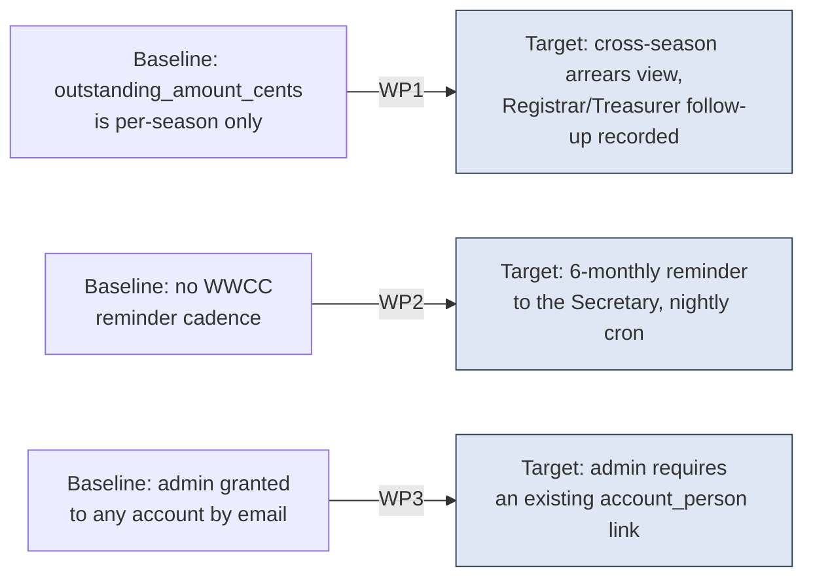

# Project Scope — Arrears Visibility, the WWCC Reminder, and the Administrator Constraint

_[← Scope index](./README.md) · [EA home](../ea/README.md)_

**ArchiMate viewpoint:** Implementation & Migration.
**Delivered as:** branch `open-questions`. **All three work packages
built.**

[Scope 47](./47_stakeholder-answers-september-2026.md) folded the
president's September 2026 answers into BR40, BR51, BR79 and BR106/BR124
as text. Three of those restatements described behaviour the platform does
not yet have: a debt from a closed season currently has nowhere to stay
visible once its registration archives; nothing prompts a Secretary to
re-verify a Working with Children Check on any cadence at all, six-monthly
or otherwise; and an administrator account can be pointed at a shared
mailbox today with nothing to stop it. This initiative builds those three
things. It does not touch the fourth restated rule, BR78 — that rule was
already enforced by [scope 35](./35_narrowing_what_a_member_can_read.md)
and September's answer only removed its "for now, pending the club"
qualifier.

## EA alignment (assessed top-down before implementing)

| Layer | Impact |
| ----- | ------ |
| 1_strategy | No change. This closes a gap in an already-adopted goal (G4, duty of care) rather than introducing a new driver. |
| 2_business | BR40, BR51, BR79 and BR106/BR124 are already restated ([scope 47](./47_stakeholder-answers-september-2026.md)); no further business-rule text changes here — this WP is where those restatements become behaviour. |
| 3_information | New: `arrears_action`, an append-only log of the Treasurer's follow-up (WP1); new **`clearance.reminder_sent_at`** column recording the six-monthly WWCC nudge (WP2); no new information object for WP3 — the administrator constraint reuses `account_person`, already the schema's record of "a named individual" (BR106/BR108), as a precondition rather than adding anywhere new to store one. |
| 4_application | New: `app_outstanding_balances()` definer function and a Registrar/Treasurer "Outstanding across seasons" screen (WP1); a scheduled job that emails the current Secretary and writes `clearance.reminder_sent_at` (WP2); `grant_club_role` rewritten to refuse `admin` to an unlinked account, with the Access screen explaining why rather than offering an option the database would refuse (WP3). |
| 5_technology | First use of a **scheduled job** in this codebase for WP2 — built as a **Vercel Cron job** (`vercel.json`, `CRON_SECRET`), not the Supabase scheduled function originally anticipated; corrected in the [technology services doc](../ea/5_technology/1_technology-services.md). Everything else is ordinary migration + RLS + screen work on the existing stack. |

## Plateaus

| Plateau | State |
| ------- | ----- |
| **Baseline** (before) | `registration.outstanding_amount_cents` exists per season but nothing aggregates it *across* seasons, so a debt from a season now closed has no screen that finds it. `clearance` records an expiry date and a one-time verification but nothing prompts re-verification on any cadence. `grant_club_role` grants `admin` to any account by email, linked to a Person or not. |
| **Target** (delivered) | A Registrar or Treasurer can see, per Person, every outstanding balance from the last two years regardless of which season it belongs to, and the Treasurer's follow-up (payment requested, or a reasoned amendment recorded) is itself recorded. Every WWCC gets a reminder to the current Secretary at six months. `grant_club_role` refuses `admin` to an account not yet linked to a Person, and the Access screen explains why rather than offering an option that would fail. |

## Work packages and deliverables

### WP1 — Outstanding-balance visibility across seasons (BR40, BR79; #30, #50) — **built**

- **Deliverables:**
  - Migration `0040_outstanding_balance_visibility.sql`:
    - `app_outstanding_balances(p_club_id uuid)` — a `security definer`
      function, in the shape [scope 42](./42_numbers_a_committee_can_act_on.md)
      established for BR142/BR143: checks the caller holds Registrar or
      Treasurer explicitly and raises rather than silently returning a
      partial view. Returns one row per Person with any `registration`
      across the last **two years** (from the season's own end date, not
      from today) where `outstanding_amount_cents > 0` — the season, the
      amount, and how long it has stood.
    - `arrears_action` table: `person_id`, `season_id`, `action`
      (`payment_requested` | `amendment_recorded`), `reason` (required
      when `amendment_recorded`), `recorded_by_user_id`, `recorded_at`.
      One row per Treasurer follow-up — an append-only log, not a status
      flag, so a family chased twice has two entries rather than one
      overwritten note. RLS: Treasurer inserts and reads; Registrar reads.
    - `app_record_arrears_action(...)` — a **security invoker** convenience
      function, not definer: RLS on `arrears_action` already decides who
      may write, so this exists only to name BR79 in the error rather than
      leaving a bare constraint violation. The constraint itself lives on
      the table, holding even against a caller that inserts directly.
  - Screen: `/registrar/arrears` — "Arrears" in the Registrar nav,
    listing every Person with an in-window balance, oldest and
    never-chased first (`arrearsQueue` in `src/domain/reporting/summary.ts`),
    with an inline form per row to record a follow-up.
  - `supabase/tests/41_outstanding_balance_visibility.sql`: 8 scenarios —
    a coach is refused (not a zero or an empty list), the two-year window
    is measured from the season's end, an amendment with no reason is
    refused twice over (the function's check and the table's constraint),
    the log is append-only, and another club's officer reads nothing.
- **Outcome:** the debt-visibility clock BR40 and BR79 now describe in
  text is a real, queryable thing, and the Treasurer's response to it
  leaves a record rather than a memory. `npm run check:full` passes,
  including the new RLS suite (32 suites total) and a production build.

### WP2 — The six-monthly WWCC reminder (BR51; #38, #75) — **built**

Two assumptions in the original plan turned out not to hold, and both are
corrected here rather than silently built around:

- **There is no `secretary` system-access role.** `club_membership.role`
  is `registrar`/`treasurer`/`committee`/`coach`/`coordinator`/`admin`/
  `viewer`; "Secretary" is a `committee_position` office held by a Person.
  So the reminder is not "restricted to Secretary and Admin" as a grant —
  it is addressed, by email, to whoever currently holds the `secretary`
  position on the club's most recent committee term.
- **BR97's read-only state gates nothing at the RLS layer today.** There
  is no policy anywhere keyed on `club_licence.state`, so there was no
  carve-out to build — `clearance_manage` already permits the
  re-verification write BR97/#75 asked for. Migration `0041`'s own comment
  records this so whoever eventually builds BR97's enforcement remembers
  to exempt `clearance`.

- **Deliverables (all built):**
  - Migration `0041_wwcc_reminder.sql`: `clearance.reminder_sent_at`;
    `app_wwcc_due_for_reminder(p_club_id)` — a definer report in 0040's
    refuse-rather-than-under-count shape, restricted to admin/registrar
    (matching `clearance_select`); `app_record_wwcc_reminder_sent(p_clearance_id)`
    — a plain `security invoker` update relying on `clearance_manage`'s
    existing RLS, since (unlike 0040's arrears report) there is no
    confident-wrong-answer failure mode here to guard against with a
    definer role check.
  - `src/domain/messaging/templates.ts`: `wwccReminder` — one email per
    club, listing every overdue clearance, stating plainly that it is the
    nudge and not the check itself.
  - `src/data/wwccReminders.ts`: `sendWwccReminders()` — finds the current
    Secretary (two plain queries against `committee_term`/`committee_position`/
    `person`, matching this codebase's convention of avoiding embedded-relation
    selects rather than one query with a join), composes and sends through
    the existing `messaging.ts`, and marks `reminder_sent_at` **only for
    clearances included in a message that actually sent** — a failed or
    suppressed send leaves them due for the next nightly run rather than
    waiting another six months.
  - `src/app/api/cron/wwcc-reminders/route.ts` — a **Vercel Cron job**, not
    a Supabase scheduled function: this stack is Next.js on Vercel
    throughout, and the Supabase-specific mechanism the plan and the
    [technology services doc](../ea/5_technology/1_technology-services.md)
    originally assumed was never actually needed. Runs nightly, checked
    against `CRON_SECRET`, using `createAdminClient('scheduled-job')` — the
    reason already existed in `src/data/client.ts`'s closed set, naming
    BR50/BR51/BR67, before this job used it for the first time.
  - `supabase/tests/42_wwcc_reminder.sql`: 5 RLS scenarios — a coach is
    refused the due-list, the six-month window holds on both edges, a
    revoked clearance is never due, and recording a reminder sent needs
    the same role as managing the clearance.
- **Outcome:** BR51's secondary mechanism — previously annual, now
  six-monthly — exists as a running job rather than a documented
  intention. `npm run check:full` passes (33 RLS suites, 717 unit tests)
  and a production build succeeds with the new route compiled.

### WP3 — The administrator invitation requires a named individual (BR106, BR124; #76) — **built**

The plan's premise did not survive contact with the codebase: **there is
no invitation flow.** `grant_club_role` (0015) gives an existing account a
role by email — it cannot create one, deliberately (minting accounts
needs the Auth admin API and the service-role key, a far larger grant than
deciding who may act at a club). Nothing here sends a first email or
collects a name at sign-up. So there was no "invitation form" to add a
full-name field to.

What "a named individual" already means in this schema is `account_person`
— the link an admin makes on the Access screen saying which Person an
account belongs to (0022, BR106/BR108). `AccessForms.tsx` already renders
an unlinked account as exactly that: *"Not linked — the club knows this
account, not who it belongs to."* A shared mailbox cannot honestly acquire
that link, because the link asserts one Person. So the enforcement is the
**existing** link, required before `admin` specifically — not a new field,
and not a schema change to `account_person` or `club_membership` either.

- **Deliverables (all built):**
  - Migration `0042_admin_requires_a_named_individual.sql`: rewrites
    `grant_club_role` (never edited in place — a migration is immutable
    once applied) to refuse `admin` when the target account has no
    `account_person` row for the club, citing BR106 — **unless the
    account already holds admin**, so this gates the grant, not an
    already-granted role's continued use, matching how BR83 gates a Team
    Official's appointment and not one already appointed.
  - `src/web/access-view.ts`: `grantableRoles()` no longer offers `admin`
    to an unlinked account (the database would refuse it regardless —
    offering it anyway is exactly the "offered and refused" defect this
    file's own conventions exist to avoid), and `adminNeedsLinkFirst()`
    lets the screen say *why*, the same pattern `revocation()` already
    used for the last-administrator rule.
  - `AccessForms.tsx`: `GrantMoreForm` shows an explanatory hint instead
    of a silently missing option when `admin` is withheld for this
    reason; `GrantAccessForm`'s initial grant (where link status is not
    yet known client-side) carries the same explanation next to the role
    field, so a refusal at the database is not the first time anyone
    hears about BR106.
  - `supabase/tests/43_admin_requires_a_named_individual.sql`: 4 RLS
    scenarios — admin refused to an unlinked account citing BR106, a
    lesser role to the same account unaffected, linking unblocks the
    grant, and an account that already held admin keeps it.
  - Corrected `supabase/tests/22_club_access.sql` scenario 9, which
    granted `admin` to a never-linked fixture account and would otherwise
    have started failing under the new rule — now links it first, the
    same sequence the Access screen itself requires.
- **Outcome:** BR124's second administrator is still free to be anyone —
  the rule stays about redundancy, not gatekeeping who — but the account
  behind them is now database-enforced, not just textually, to be tied to
  one identified person. `npm run check:full` passes (34 RLS suites, 720
  unit tests) and a production build succeeds.

## In scope / out of scope

| In scope | Out of scope (gaps, candidate future work) |
| -------- | ------------------------------------------- |
| Cross-season arrears view and the Treasurer's recorded follow-up (WP1) | A formal hardship-override **approval** workflow for BR79 — [#50](./open-questions.md) is sharpened, not closed; this WP records the follow-up, it does not adjudicate it |
| Six-monthly WWCC reminder to the current Secretary (WP2) | Programmatic register checking or a confirmed contact route into Blue Card Services — [#38](./open-questions.md) stays open; the reminder tells a human to look, it does not look itself |
| `admin` requires an existing `account_person` link (WP3) | Retroactively auditing or relinking **existing** administrator accounts granted before 0042, which may already be shared mailboxes — this WP only gates the grant going forward |
| | Disposal itself under BR40/BR49 for a Person whose arrear has cleared — this WP only stops disposal from running *while* an arrear is open; the disposal job is [#30](./open-questions.md)'s and still gated on the legal answer |

## Gap notes

- **Retroactive administrator audit.** A club may already have an admin
  account behind a shared inbox from before this WP ships. Closing that
  needs either a one-off data review (cheap, manual, and honest about what
  it can and cannot detect from an address alone) or a later migration
  that asks every existing admin to confirm a name. Left out here because
  it is a one-time cost, not an ongoing capability, and doing it well
  needs the club's own knowledge of its inboxes, not a query.
- **Hardship-override adjudication.** WP1 gives the Treasurer a place to
  record "asked for payment" or "amendment, and why" — it deliberately
  does not add a Committee-approval step, because [#50](./open-questions.md)
  has not settled who may grant an override or on what evidence. Adding
  approval later is additive to `arrears_action` (a new `action` value and
  an approver column), not a rework.

## Open questions

- No new ones. [#30](./open-questions.md)'s legal question (do BR40's
  retention figures survive Australian statutory minimums) and
  [#38](./open-questions.md)'s Blue Card Services contact route remain
  exactly as recorded — this WP builds around both without resolving
  either.
