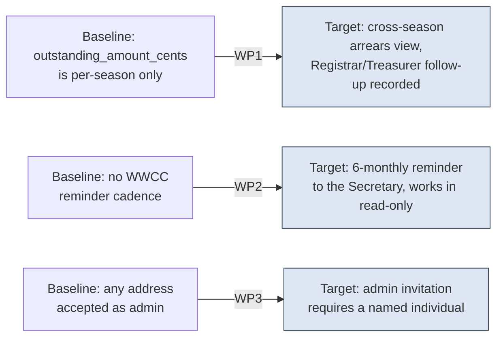

# Project Scope — Arrears Visibility, the WWCC Reminder, and the Administrator Constraint

_[← Scope index](./README.md) · [EA home](../ea/README.md)_

**ArchiMate viewpoint:** Implementation & Migration.
**Delivered as:** not yet started — this document is the plan; branch
`open-questions` carries only the documentation change that precedes it.

[Scope 47](./47_stakeholder-answers-september-2026.md) folded the
president's September 2026 answers into BR40, BR51, BR79 and BR106/BR124
as text. Three of those restatements described behaviour the platform does
not yet have: a debt from a closed season currently has nowhere to stay
visible once its registration archives; nothing prompts a Secretary to
re-verify a Working with Children Check on any cadence at all, six-monthly
or otherwise; and an administrator account can be pointed at a shared
mailbox today with nothing to stop it. This initiative builds those three
things. It does not touch the fourth restated rule, BR78 — that rule was
already enforced by [scope 35](./35_narrowing_what_a_member_can_read.md)
and September's answer only removed its "for now, pending the club"
qualifier.

## EA alignment (assessed top-down before implementing)

| Layer | Impact |
| ----- | ------ |
| 1_strategy | No change. This closes a gap in an already-adopted goal (G4, duty of care) rather than introducing a new driver. |
| 2_business | BR40, BR51, BR79 and BR106/BR124 are already restated ([scope 47](./47_stakeholder-answers-september-2026.md)); no further business-rule text changes here — this WP is where those restatements become behaviour. |
| 3_information | New: a computed **arrears** view spanning seasons (no new table — derived from `registration`); new **`clearance.reminder_sent_at`** column recording the six-monthly WWCC nudge; no new information object for the administrator constraint, which is enforced at invitation time rather than stored. |
| 4_application | New: `app_outstanding_balances()` definer function and a Registrar/Treasurer "Outstanding across seasons" screen (WP1); a scheduled function that emails the Secretary and writes `clearance.reminder_sent_at` (WP2); an administrator-invitation form change that requires an individual's name, not just an address (WP3). |
| 5_technology | First use of **Supabase scheduled functions** in this codebase for WP2 — anticipated but not yet built, per the [technology services doc](../ea/5_technology/1_technology-services.md)'s own note that BR50, BR51 and BR67 all need one. Everything else is ordinary migration + RLS + screen work on the existing stack. |

## Plateaus

| Plateau | State |
| ------- | ----- |
| **Baseline** (before) | `registration.outstanding_amount_cents` exists per season but nothing aggregates it *across* seasons, so a debt from a season now closed has no screen that finds it. `clearance` records an expiry date and a one-time verification but nothing prompts re-verification on any cadence, and BR97's read-only mode blocks writing a new clearance row outright — including the re-verification write [#75](./open-questions.md) resolved should be allowed. An administrator invitation accepts any email address, shared mailbox or not. |
| **Target** (delivered) | A Registrar or Treasurer can see, per Person, every outstanding balance from the last two years regardless of which season it belongs to, and the Treasurer's follow-up (payment requested, or a reasoned amendment recorded) is itself recorded. Every WWCC gets a reminder to the Secretary at six months, whether or not the club is in BR97 read-only. An administrator invitation requires a named individual and the form says why a shared mailbox is refused. |

## Work packages and deliverables

### WP1 — Outstanding-balance visibility across seasons (BR40, BR79; #30, #50)

- **Deliverables:**
  - Migration `0040_outstanding_balance_visibility.sql`:
    - `app_outstanding_balances(p_club_id uuid)` — a `security definer`
      function, in the shape [scope 42](./42_numbers_a_committee_can_act_on.md)
      established for BR142/BR143: checks the caller holds Registrar or
      Treasurer explicitly and raises rather than silently returning a
      partial view. Returns one row per Person with any `registration`
      across the last **two years** (from the season's own end date, not
      from today) where `outstanding_amount_cents > 0` — the season, the
      amount, and how long it has stood.
    - `arrears_action` table: `person_id`, `season_id`, `action`
      (`payment_requested` | `amendment_recorded`), `reason` (required
      when `amendment_recorded`), `recorded_by_user_id`, `recorded_at`.
      One row per Treasurer follow-up — an append-only log, not a status
      flag, so a family chased twice has two entries rather than one
      overwritten note. RLS: Treasurer inserts and reads; Registrar reads.
    - `app_record_arrears_action(...)` definer function enforcing BR79's
      "payment requested, or a documented reasoned amendment — never a
      silent write-off": `amendment_recorded` without a non-empty `reason`
      is refused.
  - Screen: an "Outstanding across seasons" view for Registrar/Treasurer,
    reachable from the existing finance screens, listing each Person with
    an arrear, its age, and its action history.
  - `supabase/tests/40_outstanding_balance_visibility.sql`: proves a coach
    gets refused (not a zero), proves the two-year window's edges, and
    proves `amendment_recorded` without a reason is rejected.
- **Outcome:** the debt-visibility clock BR40 and BR79 now describe in
  text is a real, queryable thing, and the Treasurer's response to it
  leaves a record rather than a memory.

### WP2 — The six-monthly WWCC reminder (BR51; #38, #75)

- **Deliverables:**
  - Migration `0041_wwcc_reminder.sql`:
    - `clearance.reminder_sent_at timestamptz` — when the last reminder
      fired for this clearance, distinct from `verified_at` (the check)
      exactly as `notify_attempted_at` was kept distinct from `notified_at`
      in [0039](../../supabase/migrations/0039_alert_retry.sql).
    - `app_wwcc_due_for_reminder(p_club_id uuid)` — clearances where
      `reminder_sent_at` is null or more than six months old, restricted
      to Secretary and Admin.
    - `app_record_wwcc_reminder_sent(p_clearance_id uuid)` — writes
      `reminder_sent_at = now()`, callable by the scheduled function's
      service role only, matching the platform-only shape of
      `app_record_alert_outcome` in
      [0039](../../supabase/migrations/0039_alert_retry.sql).
    - Explicitly **not** blocked by `BR97`'s read-only state: the
      migration's RLS policy on `clearance` insert/update is scoped so a
      re-verification write is the one action a read-only club may still
      perform, closing the exact gap [#75](./open-questions.md) named.
  - A Supabase scheduled function (the first in this codebase — see the
    technology-services note this closes) that calls
    `app_wwcc_due_for_reminder` for every club nightly and, for anything
    due, sends the Secretary's reminder through the existing
    Communications service (C7) and calls
    `app_record_wwcc_reminder_sent`.
  - `supabase/tests/41_wwcc_reminder.sql`: proves the six-month window,
    proves a read-only club can still write a re-verification, and proves
    the scheduled function's write path is not callable by an ordinary
    authenticated user.
- **Outcome:** BR51's secondary mechanism — previously described as
  annual and now as six-monthly — exists as a running job rather than a
  documented intention, and a lapsed club's licence no longer blocks the
  one write BR19 depends on.

### WP3 — The administrator invitation requires a named individual (BR106, BR124; #76)

- **Deliverables:**
  - No schema change: the shared-mailbox exclusion is a **process**
    constraint (nothing in an email address distinguishes
    `admin@club.org.au` shared by three people from a personal address at
    the same domain), so it is enforced at the point a human makes the
    choice, not by a regex the platform cannot actually verify.
  - Admin-invitation form (`src/app/.../invite-admin` or equivalent):
    requires a **full name** field alongside the email address before an
    invitation can be sent, and states plainly, next to the field, that
    the account may not be a shared or role-based mailbox (BR106) —
    turning a rule a club could previously violate silently into one it
    has to consciously override by typing a name that is not one.
  - `src/web/` decision (pure, tested by `node --test` per the domain
    guard): the form-validity check that a name was supplied, so the rule
    is enforced the same way whether it runs in a test or in the browser.
- **Outcome:** BR124's second administrator is still free to be anyone —
  the rule stays about redundancy, not gatekeeping who — but the account
  behind them is now visibly, not just textually, tied to one person.

## In scope / out of scope

| In scope | Out of scope (gaps, candidate future work) |
| -------- | ------------------------------------------- |
| Cross-season arrears view and the Treasurer's recorded follow-up (WP1) | A formal hardship-override **approval** workflow for BR79 — [#50](./open-questions.md) is sharpened, not closed; this WP records the follow-up, it does not adjudicate it |
| Six-monthly WWCC reminder, working in BR97 read-only (WP2) | Programmatic register checking or a confirmed contact route into Blue Card Services — [#38](./open-questions.md) stays open; the reminder tells a human to look, it does not look itself |
| Admin-invitation name requirement (WP3) | Retroactively auditing or relinking **existing** administrator accounts that may already be shared mailboxes — this WP only changes the invitation path going forward |
| | Disposal itself under BR40/BR49 for a Person whose arrear has cleared — this WP only stops disposal from running *while* an arrear is open; the disposal job is [#30](./open-questions.md)'s and still gated on the legal answer |

## Gap notes

- **Retroactive administrator audit.** A club may already have an admin
  account behind a shared inbox from before this WP ships. Closing that
  needs either a one-off data review (cheap, manual, and honest about what
  it can and cannot detect from an address alone) or a later migration
  that asks every existing admin to confirm a name. Left out here because
  it is a one-time cost, not an ongoing capability, and doing it well
  needs the club's own knowledge of its inboxes, not a query.
- **Hardship-override adjudication.** WP1 gives the Treasurer a place to
  record "asked for payment" or "amendment, and why" — it deliberately
  does not add a Committee-approval step, because [#50](./open-questions.md)
  has not settled who may grant an override or on what evidence. Adding
  approval later is additive to `arrears_action` (a new `action` value and
  an approver column), not a rework.

## Open questions

- No new ones. [#30](./open-questions.md)'s legal question (do BR40's
  retention figures survive Australian statutory minimums) and
  [#38](./open-questions.md)'s Blue Card Services contact route remain
  exactly as recorded — this WP builds around both without resolving
  either.
