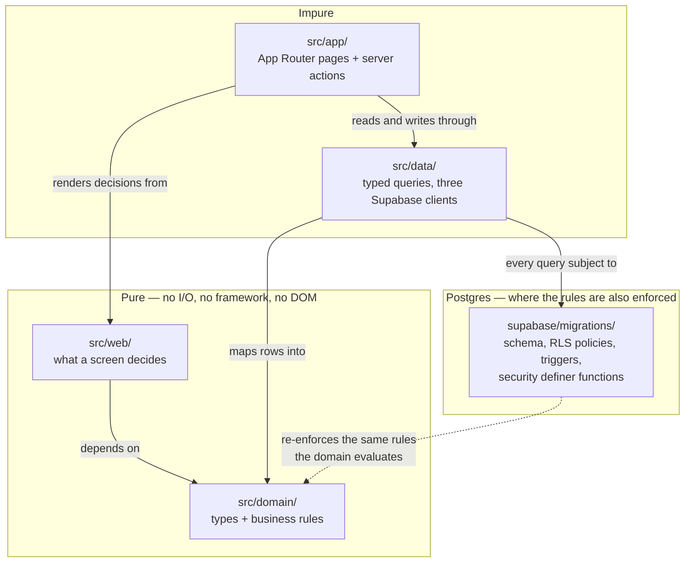

# Design

_[← Spec](./README.md) · [Requirements](./requirements.md) · [Tasks](./tasks.md) · [Technology layer](../ea/5_technology/README.md)_

**Purpose.** The technical architecture and implementation approach —
**the decisions already made and standing**, the patterns that follow from
them, and a recommendation where a decision is still open.

The architecture itself lives in [`docs/ea/`](../ea/README.md), layer by
layer. What this document adds is the *builder's* view: the small number of
structural choices that everything else in `src/` and `supabase/` is a
consequence of, stated in one place so a new contributor (or agent) does not
have to reconstruct them from 29 migrations.

---

## 1. The one decision the rest hangs from

**Tenant isolation is enforced by the database, not by application code.**

Principle P5 says one club's data is never visible to another. There are two
ways to keep that promise: remember `where club_id = …` in every query
forever, or make the database refuse. The first fails through an ordinary
omission — a missing filter in application code is a cross-tenant leak of
children's personal data, and it is silent. The second fails closed: a query
missing its filter returns *nothing* rather than *everything*.

Supabase was chosen for that property and essentially that property. Every
other technology choice is downstream of it:

| Concern | Choice | Because |
| ------- | ------ | ------- |
| Database, auth, access control | **Supabase** (managed Postgres + Auth + RLS) | P5 becomes structural. Auth is bundled, so the permission model cannot drift from the data model |
| Application framework | **Next.js** App Router, TypeScript | One codebase for server-rendered admin screens and the API a future mobile client calls. TypeScript because a legal name and a preferred name are both strings, and only the type system stops them being swapped (BR55) |
| Hosting / CI-CD | **Vercel** | A preview deployment per pull request — the review artifact this project has used all along |
| CI | **GitHub Actions** | Three workflows: `code-check`, `docs-check`, `rls-behaviour` |
| File storage | **Supabase Storage** | Same access-control model, so a photograph cannot be more readable than the row referencing it |
| Region | **Sydney `ap-southeast-2`** | Children's data onshore — not an APP requirement, but it removes a question no club committee wants to answer |

**The cost, stated plainly:** vendor concentration. Database, auth, storage
and policy all sit with one provider. The mitigation is that it is Postgres
underneath, so the data and schema are portable even where the platform is
not — which is what keeps BR68 (the club owns its data) honest for
Let'sDataTalk itself.

---

## 2. Layering, and the boundary that is mechanically enforced

**`src/domain/` and `src/web/` are pure, and it is checked rather than
asked for.** `npm run typecheck` runs `tsc` twice; the second pass uses
`tsconfig.domain.json`, which compiles those two directories **with no DOM
library**. A `document.` or `window.` reaching into either fails the build
instead of waiting for a reviewer to notice. React and the Supabase client
are equally out.

That buys three things:

1. **Every business rule is unit-testable without a database.** 73 suites
   and 561 assertions run in about two seconds, with no build step — Node 22
   strips the types at run time.
2. **Screens are testable.** What a screen *decides* — which pile a
   registration belongs in, what is wrong with a form, whether a card may
   claim "Registered" — lives in `src/web/` as a pure function. The `.tsx`
   renders the decision and little else. A card saying "Registered" over a
   child who cannot take the field is a BR79 failure that would look fine
   in review and fails a test instead.
3. **The rule set is diffable against the architecture.** A reviewer can
   read `src/domain/rules/` against
   [`5_domain-context-and-rules.md`](../ea/2_business/5_domain-context-and-rules.md).
   That is the only mechanism by which 126 rules stay honest against the
   code.

**Rule identifiers are the business rule numbers.** A `validation_result`
row records `BR55`, not `"legal name mismatch"`. Prose gets reworded; the
identifier is the join between the running system and the architecture, and
it is what makes a failure report readable years later.

---

## 3. Where a rule is enforced

The same rule is often expressed twice — once as a pure function that can
explain itself to a registrar, once as a database constraint that cannot be
talked around. That is not duplication; the two answer different questions.

| Mechanism | Use it for | Examples |
| --------- | ---------- | -------- |
| **Pure domain function** | A rule whose *explanation* is the product. The registrar needs to know **what** is missing and **why** | BR1, BR2, BR3, BR48, BR55 — each returns an outcome carrying its identifier and a human sentence |
| **Database trigger** | A rule whose violation must be impossible, not merely reported | BR74 (instalments sum exactly — a deferred constraint trigger), BR83/BR84 (no clearance, no appointment — on insert **and** update, because promoting a player row to a coach row is the obvious bypass), BR56 (a photograph without consent), BR87 (an adult at the term's start) |
| **RLS policy** | Who may see or change a row at all | All 45 tables. Append-only is expressed as **the absence of an update policy** — with RLS on, an operation with no policy is denied |
| **`security definer` function** | The narrow, audited crossing of a boundary | `submit_public_registration` (the only anonymous write, with a pinned `search_path`), `app_create_registration` (one creation path), `merge_person`, `app_my_person_ids` / `app_family_club_ids` (a family's read, reached through `auth.uid()` and never an argument) |
| **Partial unique index** | A uniqueness that holds only in a state | One live payment plan per registration (`where cancelled_at is null`) |

**Choosing between them:** if getting it wrong costs a child their
eligibility, their privacy, or the club its money, it belongs in the
database *as well as* the domain. If getting it wrong merely produces a
worse message, the domain alone is enough.

---

## 4. The access model

Three Supabase clients, differing in exactly one way that matters — whether
RLS applies:

| Client | RLS | Used by |
| ------ | --- | ------- |
| `createUserClient` | **Applies** | Almost everything. The browser, and server code acting as the signed-in user |
| Request-scoped server client | **Applies** | Server components and actions, with the session refreshed by `src/proxy.ts` so `auth.uid()` keeps resolving |
| `createAdminClient(reason)` | **Bypassed entirely** | Three reasons, and only three |

`createAdminClient` takes a **closed set of reasons** — `tenant-provisioning`,
`scheduled-job`, `submission-pack-generation` — rather than a free string, so
every bypass in the codebase is greppable and the list is itself reviewable.
Adding a member is a deliberate act; passing one is not something that
happens by accident. **This pattern is the model for any future privileged
capability**: make the escape hatch enumerable.

**Reads are narrowed by role, not by club.** The pattern the newer policies
follow (BR120) is `club_id in (select app_member_club_ids(...))` with the
roles the data is *for* named explicitly — a coach sees whether a player is
clear to take the field and never what the family owes (BR78). A family
reaches its household through a **function rather than a membership**
([decision 11](../decisions/11_a_family_reads_through_functions_not_membership.md)),
so that a `guardian` role does not inherit every still-wide-open policy.

**And a narrowing is proved by a test that fails when it is widened**
(BR122): a read policy naming roles ships with a scenario asserting the
excluded role reads nothing. `check_rls.py` proves a policy *exists*;
`test_rls.sh` applies the real migrations to a throwaway Postgres and proves
it *works*. A policy can be present and wrong, and that failure is silent.

---

## 5. Application patterns

**Server actions, checked.** Forms post to `'use server'` actions in an
`actions.ts` beside the page. Next throws on a bad `use server` export at
*request* time rather than build time — which is how a broken sign-in page
once shipped past a green build — so `scripts/check_server_actions.py` fails
the build if such a module exports anything but an async function.

**One shape for what a form hands back.** `FormResult` is
`idle | ok | error`, always with a message. Actions previously returned
`string | null` — a message on failure, nothing on success — so a registrar
who recorded a clearance got no acknowledgement and had to go and look.
**Silence is not a success state:** it is indistinguishable from a click
that did not register, and it teaches people to press twice.

**Status is derived, never set.** A registration's status comes from its
rule outcomes (`registration-status.ts`); eligibility to play is asked
fresh from status *and* balance together, every time, and never stored
(BR79). A stored eligibility flag is a cached answer that goes wrong
quietly the moment a payment lands.

**History, not current values.** Recurring shape across the schema: a
referee's classification is dated rows, not a column (BR110); a fee schedule
is a published version, not an edited rate (BR115); a claim stores the
amount it was computed at rather than resolving a rate at read time (BR116);
a superseded payment plan is cancelled, not replaced. Where a past answer
has to stay answerable, the design stores rows and never overwrites.

**Consent is rows, not columns** — one per purpose, each with its own grant,
authority and revocation. A boolean cannot record who granted it, when, or
that it was revoked on Tuesday, and BR48 requires all three.

---

## 6. Verification strategy

Four gates, in the order CI runs them (`npm run check`), plus the one that
matters most:

| Gate | Proves | Runs in |
| ---- | ------ | ------- |
| `npm run typecheck` | Types, **and the purity of `src/domain/` + `src/web/`** via the second, DOM-free pass | `code-check` |
| `npm test` | 73 suites / 561 assertions, no build, no database | `code-check` |
| `npm run build` | The **only** check of Next's typed routes — a broken `redirect()` target is invisible to `tsc` alone | `code-check` |
| `check_rls.py` | Every table has RLS, a policy and a `club_id`. **A gate, not a lint** | `code-check` |
| `check_server_actions.py` | No `'use server'` module exports a non-async binding | `code-check` |
| `check_links.py` | Every relative Markdown and HTML link resolves | `docs-check` |
| **`test_rls.sh`** | **The real migrations against a real Postgres**: that a registrar at one club cannot read, write, update or delete another club's rows; that append-only tables really are; that a non-member and an anonymous caller see nothing | `rls-behaviour` |

24 SQL test files now carry that last job, from tenant isolation through
public registration, payment plans, clearances, committee adults, the
referee slice and the family's household reads.

---

## 7. Deployment

| Environment | Runs on | Database |
| ----------- | ------- | -------- |
| Local | `next dev` (3000; `dev:alt` on 3001 for side-by-side) | The **development** Supabase project |
| Preview | Vercel, one per pull request | The same development project — never production |
| Production | Vercel, Sydney | **Does not exist yet** |

Two consequences worth stating because they have already caused confusion:

- **"Applied to production" in this repository's history before September
  2026 means applied to the development project.** The commit messages say
  production and are wrong about which one.
- **A migration merged to `main` runs against the linked project with no
  second confirmation.** That project holds the only copy of the data there
  is. Hence: never edit an applied migration — corrections are new
  migrations — and never merge a schema change whose RLS test has not run.

**A preview URL is effectively public.** Pointing one at real data would put
800 children's records behind a link anyone can open, so environment
variables are set per Vercel environment and the rule binds the moment a
production project exists.

---

## 8. Recommendations where a decision is still open

These are recommendations, not decisions. Each would need the EA-first walk
and a scope document before implementation.

**R1 — Build C7 (communications) next, before any new user-facing
capability.** ✅ **Done, September 2026** — [scope 36](../scope/36_the_platform_learns_to_send_and_to_stop.md)
took the recommendation below, including suppression in Postgres rather than
at the provider. The recommendation is kept rather than deleted because what
it predicted is what shipped, and the reasoning is the record.

 It is the constraint that makes three other things impossible:
BR42's coordinator notification, BR64's fixture-change notification, and
telling a referee their claim was approved (they currently find out by being
paid). It is also a **compliance exposure today**: marketing consent is
being collected at the demonstration door with nowhere to send anything and
**no unsubscribe mechanism**, which is the part that is not merely missing
but arguably non-compliant. *Recommended approach:* a transactional provider
(Resend or AWS SES) behind a small `src/domain/messaging/` template layer
that is pure and testable, with suppression state in Postgres rather than at
the provider — so the unsubscribe survives a provider change and is subject
to the same RLS as everything else.

**R2 — Implement BR49 (erasure) and BR40 (retention) together, as one
initiative.** ✅ **Done, September 2026** — [scope 37](../scope/37_forgetting_and_the_reasons_not_to.md)
built them as one machinery over one `retention_basis` table, with the
refusal as a pure function exactly as proposed. Two things the
recommendation did not anticipate, both settled in decision records:
erasure **deletes or refuses and never redacts**, and the retention job
**proposes rather than executes**.

 They are the same machinery seen from two directions, both are
statutory rather than desirable, and neither exists. *Recommended approach:*
a `retention_basis` table naming the lawful basis that refuses an erasure,
evaluated by a pure domain function so the refusal is explainable, executed
by a Supabase scheduled function under `createAdminClient('scheduled-job')`
— the bypass reason is already enumerated for exactly this.

**R3 — Enforce BR97 (a lapsed licence means read-only) or stop displaying
it as though it were enforced.** It is currently *shown and not enforced*,
which is the worst of the two states: the screen asserts a control that does
not exist. *Recommended approach:* a single `app_club_is_writable()` check
in the `with check` clause of the write policies, rather than application
guards that will be forgotten on the next screen.

**R4 — Close BR113 (a minor official's designation goes to their guardian)
before the referee slice is used with real under-18 officials.** It is a
duty-of-care rule with no code, in a slice otherwise built out, and BR33
already establishes the routing pattern for a minor referee's calendar feed.

**R5 — Defer the native mobile client (C17) further, and keep the `/me`
shell as the answer.** Read-only offline (BR66) is the decisive requirement
that argues for a real app, and it is not yet urgent; the role-context shell
already delivers the substance of "one app per Person, showing the role they
are acting in" (BR61, BR63, BR65) through the browser. Revisit when a club
asks for offline, not before.

**R6 — Define NFR-15 through NFR-17 (accessibility, performance budgets,
backup/restore) before the first real club, not after.** None is defined
today. The pilot's ~700 registrations per season make the performance
question answerable cheaply now — pack generation across a full season is
the one operation whose cost is not obviously bounded — and a restore has
never been rehearsed against a project holding the only copy of the data
there is.
