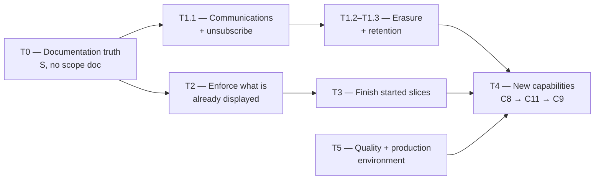

# Tasks

_[← Spec](./README.md) · [Requirements](./requirements.md) · [Design](./design.md)_

**Purpose.** The actionable development roadmap: every gap
[requirements.md](./requirements.md) found, sized, prioritised, and stated
as work someone can pick up.

**How to use this list.** A task here is **not** a licence to start coding.
Everything below `T0` follows the EA-first rule: align the layers, write the
scope document, then implement (`ea-first-change`). What this document
provides is the *queue* and the *reason* — the scope document is still
where the design gets settled.

| Field | Meaning |
| ----- | ------- |
| **Size** | S ≈ under a day · M ≈ a few days · L ≈ an initiative with its own scope document |
| **Gate** | What must be true before the task is done, beyond `npm run check` |

---

## T0 — Documentation truth (do first, no scope document needed)

These are corrections, not behaviour changes. Under
[CLAUDE.md](../../CLAUDE.md) they skip the EA alignment and still must keep
the docs true. They are first because every one of them makes a reader
believe the project is earlier than it is — including a reader deciding
what to build next.

> **T0 is complete** (13 September 2026). The four documents findings F1–F4
> named now describe the system as it is; correcting the
> application-components inventory turned up a fifth omission in passing —
> the referee slice had **no component rows at all**, so the six that
> realise it were added rather than left for a reader to find in the
> migrations. The seven directory READMEs
> [steering §3](../steering/2_code-commenting-and-documentation.md) requires
> now exist, and `CONTRIBUTING.md`'s gate table names all seven gates rather
> than four.
>
> The rows stay listed rather than deleted: T0 is the record of how far the
> documentation had drifted, and the next reader benefits more from that
> than from a shorter table.

| # | Task | Size | Gate |
| - | ---- | ---- | ---- |
| ~~T0.1~~ | **Rewrite the root [README.md](../../README.md) status and commands sections.** It says "no application code exists yet" and that commands "will be added… once a technology stack is chosen". 29 migrations, 45 tables and 561 passing assertions say otherwise (finding F1) | S | Status reflects the delivered slices; the Commands section matches `package.json` |
| ~~T0.2~~ | **Correct [`docs/ea/README.md`](../ea/README.md)'s status table.** Layers 3–5 are marked "Not started" and "have nothing to say yet"; all three are written (finding F2) | S | The table matches the files, and the "Reading order" paragraph stops deferring to a future initiative |
| ~~T0.3~~ | **Correct [`4_application/1_application-services.md`](../ea/4_application/1_application-services.md).** C4 and C5 are listed under "Not started — no design and no code", and the closing section states "the referee half of the product does not exist". Scope 33 and 34 built it (finding F3) | S | C4/C5 rows move to Delivered or Partial with their gaps named; the closing section is rewritten |
| ~~T0.4~~ | **Correct [`3_information/1_data-objects.md`](../ea/3_information/1_data-objects.md)'s "Not yet modeled" section**, which lists finance, referee appointments and payment, and fixtures — all modeled and built (finding F4) | S | Section lists only what is genuinely unmodelled (carnivals, calendar subscriptions, participation responses) |
| ~~T0.5~~ | **Add the READMEs [steering §3](../steering/2_code-commenting-and-documentation.md) now requires** to `src/domain/`, `src/web/`, `src/app/`, `src/data/`, `supabase/migrations/`, `supabase/tests/` and `scripts/`. None exists today | M | Each carries Purpose, Key dependencies, Layout, and a link to its governing EA document |
| ~~T0.6~~ | **Update [CONTRIBUTING.md](../../CONTRIBUTING.md)**, which still says "BR1–BR68" where there are 126 rules, and omits `check_server_actions.py` from its gate table | S | Rule range and gate table match reality |

---

## T1 — Compliance gaps (statutory, not desirable)

Each of these is a rule the architecture states, a regulator would expect,
and no code performs.

| # | Task | Rules | Size | Gate |
| - | ---- | ----- | ---- | ---- |
| ~~T1.1~~ | **Communications and, specifically, an unsubscribe** (recommendation R1). **Done** — [scope 36](../scope/36_the_platform_learns_to_send_and_to_stop.md), built unsubscribe-first. Marketing consent is being collected at the demonstration door with nothing to send it and **no way to withdraw** — the only gap here that is arguably non-compliant *today* rather than merely missing | C7, BR93 | L | Suppression state in Postgres under RLS; a pure `src/domain/messaging/` template layer; an unsubscribe that works without an account |
| ~~T1.2~~ | **Right to erasure** — honoured unless a named lawful basis requires retention, and the basis recorded when it refuses | BR49 | L | A pure function explains every refusal; the refusal names its basis; a test proves an erasure that must be refused *is* |
| ~~T1.3~~ | **Retention by participation status**, with the ten-year floor and the life-member override | BR40, BR70 | L | Scheduled function under `createAdminClient('scheduled-job')`; no life member is ever discarded |
| T1.4 | **Continuous WWCC verification**: expiry withdraws the holder from every *future* assignment rather than only blocking new ones | BR50, BR51 | M | A lapse removes the holder from future match sheets; a test asserts the withdrawal, not just the block |
| ~~T1.5~~ | **Transfer of rights at eighteen** — consent, erasure, calendar, account and publicity move from guardian to the young person | BR67 | M | A dated, audited transfer; the guardian's authority ends and their contact role does not |
| T1.6 | **A minor official's designation is proposed to their guardian**, not to them (recommendation R4) | BR113 | S | Mirrors BR33's routing; no under-18 official is designated directly |
| ~~T1.7~~ | **Per-tenant privacy framework**, determined by jurisdiction and recorded rather than assumed | BR52 | S | A column, read by the rules that vary by regime |

> **T1.1, T1.2, T1.3, T1.5 and T1.7 are done** (September 2026) —
> [scope 36](../scope/36_the_platform_learns_to_send_and_to_stop.md) and
> [scope 37](../scope/37_forgetting_and_the_reasons_not_to.md). Recommendation
> R2 was right that erasure and retention are one machinery seen from two
> directions, and they were built as one. **T1.4 and T1.6 remain**, and both
> are safeguarding rather than privacy: a lapsed clearance still only blocks
> new assignments instead of withdrawing existing ones, and an under-18
> official's designation still goes to them rather than their guardian.

---

## T2 — Controls that are displayed but not enforced

The dangerous category: a screen asserting a control that does not exist is
worse than an absent feature, because somebody relies on it.

| # | Task | Rules | Size | Gate |
| - | ---- | ----- | ---- | ---- |
| T2.1 | **A lapsed licence puts the club into read-only** — currently *shown and not enforced* (recommendation R3) | BR97 | M | Enforced in the `with check` of the write policies, not in application guards; nothing is deleted or hidden |
| T2.2 | **A club holds at least two administrators.** No constraint enforces the floor; a club with one cannot remove that one and cannot get back in if they leave | BR124 | S | The second-last administrator cannot be removed |
| T2.3 | **BR15 made testable.** The assistant never changes a status — structurally true because no generative step exists. It should stay true *by test* before one does | BR15, P3 | S | A test that fails if an assistant surface gains a committing control |
| T2.4 | **BR122 made a gate rather than a convention.** A read policy naming roles must ship with a scenario asserting the excluded role reads nothing — today that is discipline, not a check | BR122 | M | `check_rls.py` (or a sibling) fails a role-narrowed policy with no exclusion scenario |
| T2.5 | **BR75 given a source reference.** The partial unique index enforces one live plan; no comment names the rule, so it is invisible to a reviewer diffing rules against code | BR75 | S | The identifier appears where the constraint is defined |

---

## T3 — Completing started slices

Work where most of the slice exists and a named piece does not.

| # | Task | Rules | Size | Gate |
| - | ---- | ----- | ---- | ---- |
| T3.1 | **The fee schedule editor.** Schema and rate resolution are delivered; a club cannot author a schedule through a screen (scope 34, WP2) | BR115 | M | A new rate publishes a new dated schedule; the old one stays readable |
| T3.2 | **The decline-rate threshold**, deliberately deferred until a season of history exists to set it | BR12 | S | Configurable per classification/competition, never hardcoded |
| T3.3 | **The committee's own dated resolutions.** Approvals resting on committee authority currently point at nothing | BR123 | M | A resolution names what was decided, who moved it, and its term |
| ~~T3.4~~ | **Life member register** — an indefinite role with no season, surviving death | BR69–BR71, C18 | M | Design exists ([scope 18](../scope/18_life-members.md)); waiting on priority alone |
| ~~T3.5~~ | **The club's data export.** "Nearly free" under Postgres and not written | BR68 | M | A complete, club-scoped export the club can take elsewhere |

---

## T4 — New capabilities

Each is an initiative with its own scope document. Ordered by what unblocks
the most.

| # | Capability | Blocked by | Size |
| - | ---------- | ---------- | ---- |
| T4.1 | **C8 — Reporting and dashboards.** The registration, financial and referee numbers a committee actually asks for | Nothing. The data exists | L |
| T4.2 | **C11 — Competition and calendar.** `fixture.competition` is free text because no catalogue exists; BR20 and BR8's classification minimums both want one | Nothing | L |
| T4.3 | **C9 — Historical data consolidation.** The pilot club committed three years; C8 is what it is *for* | **Open question [#57](../scope/open-questions.md)** — the lawful basis for importing it | L |
| T4.4 | **C13 — Calendar distribution.** A Person's own confirmed commitments as a subscribable feed | Nothing. [Decision 4](../decisions/4_calendar-distribution-by-feed-not-account-access.md) settles the approach | M |
| T4.5 | **C12 — Carnival and event management**, including the account-free public view — the one deliberate P5 exception | C11 | L |
| T4.6 | **C17 — Native mobile client.** Recommended deferred (R5): `/me` already delivers the substance; offline (BR66) is the trigger to revisit | Nothing, but not yet warranted | L |
| T4.7 | **C14 — External reconciliation** against SQUADI / PlayFootball | **Externally blocked.** API access is restricted to approved system partners; open questions [#39–#41](../scope/open-questions.md). A commercial motion, not a technical one | L |
| T4.8 | **Payments (C3's remaining half).** Square is chosen and unintegrated; a treasurer types in what arrived | A decision that it is time | L |

---

## T5 — Engineering quality

| # | Task | Requirement | Size | Gate |
| - | ---- | ----------- | ---- | ---- |
| T5.1 | **Define and measure performance budgets**, starting with pack generation across a full season (~700 registrations) — the one operation whose cost is not obviously bounded | NFR-16 | M | A stated budget and a measurement against it |
| T5.2 | **Accessibility audit** of the club-facing screens against WCAG 2.2 AA, and an automated check in `code-check` | NFR-15 | M | A baseline, then a gate |
| T5.3 | **Rehearse a restore.** No backup has ever been restored, against a project holding the only copy of the data there is | NFR-17 | S | A documented RPO/RTO and one successful rehearsal |
| T5.4 | **Stand up a real production environment** and stop pointing local development at the project that holds the data | NFR-9 | M | Preview never reaches production; per-environment variables verified |
| T5.5 | **Mechanically prevent editing an applied migration.** Today it is convention, and the consequence is irreversible | NFR-10 | S | A check that fails when a migration already on `main` changes |

---

## Suggested sequence

**The reasoning behind that order.** T0 is a day's work that stops every
subsequent reader mis-estimating the project. T2 removes controls that lie.
T1.1 is first among the compliance gaps because it is the only one that is a
live exposure rather than an absent feature, and because T1.2 and T1.3 both
need something to notify with. T5.4 gates the first real club regardless of
what else is built, so it runs alongside rather than after. New capabilities
come last not because they matter least, but because each one built on top
of an unenforced control or an absent erasure path makes both harder to
retrofit.
