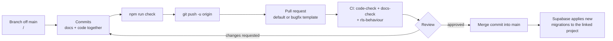

# Git Workflow

_[← Steering](./README.md) · [CONTRIBUTING](../../CONTRIBUTING.md)_

**Scope:** branch naming, commit practice, the merge workflow, and — the
part that distinguishes this from a style guide — **the git actions Claude
performs on its own during development**, and the ones it never performs
without being asked.

This document says *how the work travels*. What the work must satisfy before
it travels is [CONTRIBUTING.md's definition of done](../../CONTRIBUTING.md#definition-of-done);
nothing here relaxes it.

---

## 1. Branches

### 1.1 Naming

```
<actor>/<topic-in-kebab-case>
```

| Segment | Rule |
| ------- | ---- |
| `<actor>` | `claude/` for work an agent drives; a person's own short prefix otherwise. The prefix says **who is accountable for the branch**, not who typed it |
| `<topic>` | Two to five kebab-case words naming **the outcome, not the mechanism**. `guardian-household`, `narrow-the-reads`, `referee-lifecycle` — never `fix-stuff`, `wip`, `update-3` |

Observed and endorsed: `claude/referee-lifecycle`,
`claude/guardian-household`, `claude/narrow-the-reads`,
`claude/player-record-and-statistics`.

Three further rules:

- **No issue numbers, no dates, no ticket IDs** in the branch name. The
  scope document is the identifier that survives; a branch is scaffolding.
- **A random suffix is tolerated, never chosen.** Tooling sometimes appends
  one (`claude/new-session-oizu88`). Do not add one by hand — it makes the
  branch unsearchable.
- **One initiative per branch.** If the work splits into two scope
  documents, it is two branches.

### 1.2 The designated branch overrides this section

When a session is given a **designated development branch**, that name is
authoritative even if it does not match §1.1. Develop there, push there,
and **never push to a different branch without explicit permission**. If the
branch does not exist locally, create it; if its pull request has already
merged, restart it from the latest `main` rather than stacking new commits
on merged history.

### 1.3 Never work on `main`

`main` is what deploys and what Supabase applies migrations from. Claude
never commits to `main` directly, and never force-pushes any shared branch.
If work has begun on `main` by accident, move it:

```bash
git branch <actor>/<topic> && git reset --hard origin/main && git checkout <actor>/<topic>
```

---

## 2. Commits

### 2.1 Format

[Conventional Commits](https://www.conventionalcommits.org/), as
[CLAUDE.md](../../CLAUDE.md) requires:

```
<type>: <subject>

<body — why, not what>

Co-Authored-By: …
```

| Type | Used for |
| ---- | -------- |
| `feat` | New or changed behaviour a user can observe |
| `fix` | A defect in behaviour that was already documented |
| `docs` | EA layers, scope documents, steering, READMEs, annexes, decisions |
| `chore` | Dependencies, config, tooling with no behavioural effect |
| `test` | Tests added to existing behaviour, alone |
| `refactor` | Structure changed, behaviour identical |

### 2.2 The subject line carries the outcome

This repository's commit log reads as prose, and that is deliberate — it is
the narrative a reviewer follows a year later. Write the subject as **what
became true**, in the present tense, lowercase after the type, no trailing
period:

```
feat: a guardian sees every child at a glance (scope 35, WP5)
feat: the referee's own record — C4's first code (scope 33, WP1)
fix: the password page asked for a password
docs: the business layer said nothing was built, months after it was
```

not `feat: add GuardianWorkspace.tsx`, which describes the diff the reader
can already see.

**Cite the initiative where one exists** — `(scope 35, WP5)`, `(WP1
complete)`. That is the join between the log and
[`docs/scope/`](../scope/README.md).

### 2.3 What a commit contains

- **One coherent step.** A migration ships in the same commit as the RLS
  policy it needs (`check_rls.py` is a gate, not a lint) and the test that
  proves the policy works. A rule ships with its unit test.
- **Docs and code together.** Under the EA-first rule a behaviour change
  whose EA and scope documents lag is an incomplete commit, not a
  follow-up.
- **Language: English**, for subjects and bodies alike.
- **No model identifier** in any commit message, PR title, or PR body.
- **Never amend or rebase a commit that has been pushed** to a shared
  branch. A correction is a new commit, for the same reason a correction to
  an applied migration is a new migration.

### 2.4 Before every commit

Run the gate that matches what changed, and **report the real result**:

| Changed | Run |
| ------- | --- |
| Anything under `src/` | `npm run typecheck && npm test` |
| Anything under `supabase/migrations/` | `python3 scripts/check_rls.py`, then `bash scripts/test_rls.sh` |
| Any `*.md` | `python3 scripts/check_links.py` |
| A branch about to be pushed | `npm run check` (all four, in CI's order) |

A red check is never committed around. If a check cannot run in the
environment — `test_rls.sh` needs `psql` — say so explicitly in the PR body
rather than implying it passed.

---

## 3. The merge workflow



**Rules on the merge itself:**

- **Merge commits, not squash, not rebase-merge.** The log's per-work-package
  granularity is the point; squashing a branch that delivered four work
  packages destroys it. The history shows merge commits and keeps them.
- **A pull request is required.** Even for a one-line fix — CI's
  `rls-behaviour` job only runs on a PR or a push to `main`, and the
  preview deployment is the review artifact.
- **The PR body covers the whole branch** (`git diff main...HEAD`), not the
  latest commit, and uses the right template: the
  [default](../../.github/pull_request_template.md) for anything touching
  documented behaviour, [bugfix](../../.github/PULL_REQUEST_TEMPLATE/bugfix.md)
  for a pure defect fix. See the `pr-description` skill.
- **Green CI before merge, every time.** `code-check`, `docs-check`, and
  `rls-behaviour`.
- **A schema change never merges with an unrun RLS test.** Merging to `main`
  applies the migration to the linked Supabase project with no second
  confirmation, and that project holds the only copy of the data there is.
- **Bring `main` in by merging it into the branch**, never by rebasing a
  branch someone else may have checked out.
- **Delete the branch after merge.** The scope document is the record.

---

## 4. What Claude does, and when

This is the operative section. The verbs are deliberate: **do** means
perform it without being asked; **ask** means stop and put it to the user.

### 4.1 Do, unprompted

| Moment | Action |
| ------ | ------ |
| Starting work | `git status` and `git branch --show-current` **before the first edit** — know which branch you are on rather than assuming |
| Not on a working branch | Create the designated branch (or `<actor>/<topic>`) off the latest `main` |
| A coherent step is finished and its checks pass | Commit it, per §2 |
| Work is complete | Run `npm run check`, then `git push -u origin <branch>` |
| A push fails on a network error | Retry up to four times, backing off 2s, 4s, 8s, 16s. A *rejected* push is not a network error — see §4.2 |
| Before reporting done | `git log --oneline origin/main..HEAD` and `git status` — confirm what actually landed, and that nothing is left uncommitted |

### 4.2 Ask first

- **Opening a pull request.** Never open one unless the user asked for it.
- **Pushing to any branch other than the designated one.**
- **`git push --force` / `--force-with-lease`** on a shared branch. The one
  exception: a designated branch that contains only already-merged history
  being restarted from `main`.
- **Merging anything** — into `main` or between branches — and **approving**
  a pull request. An agent never approves its own or anyone else's.
- **`git reset --hard`, `git clean -fd`, `git checkout -- .`, or deleting a
  branch** when uncommitted work exists. Look at what would be lost first.
- **A rejected push** (`non-fast-forward`). Fetch, inspect the divergence,
  and say what you found. Do not resolve it by forcing.

### 4.3 Never

- Commit to `main`, or push to it.
- Rewrite history on a branch someone else may hold — no rebase, no amend,
  no force-push.
- Commit a secret. `SUPABASE_SERVICE_ROLE_KEY` and `SUPABASE_DB_PASSWORD`
  live in `.env.local`, which is gitignored, and in Vercel's
  server-scoped variables. If one has been committed, stop and say so —
  rotation, not a revert, is the fix.
- Commit an edit to a migration that has already been applied. Corrections
  are new migrations.
- Push the same change twice under two commits because the first push
  appeared to fail. Check `git log origin/<branch>` first; the history
  already carries one such pair.
- Disable, skip, or `.only` a test to get a green check.
