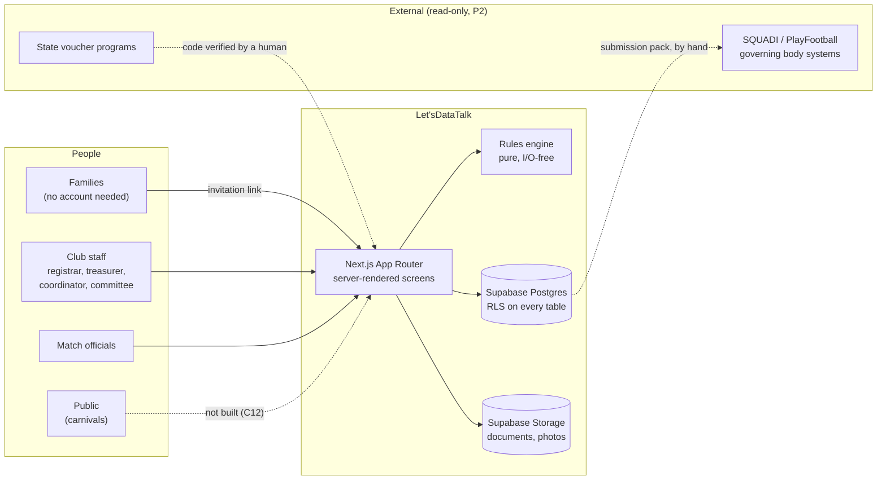
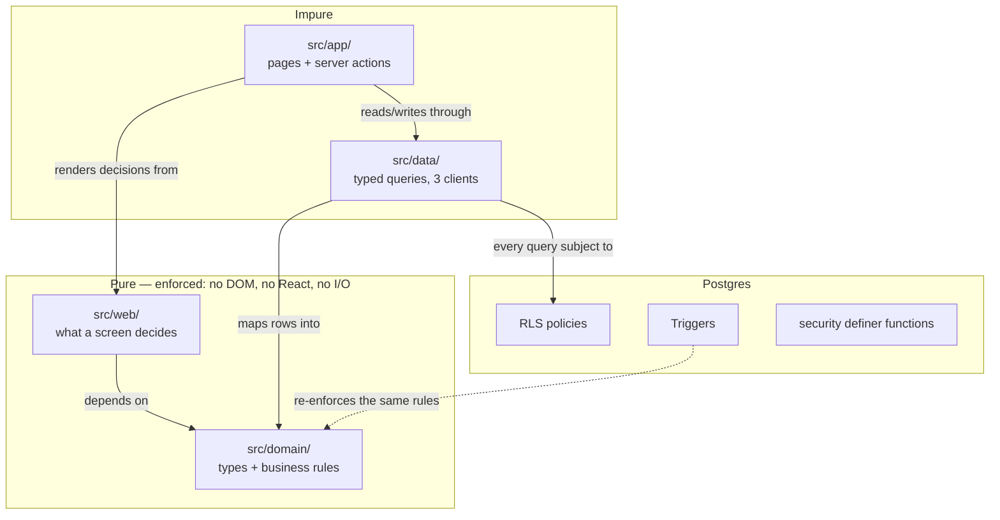
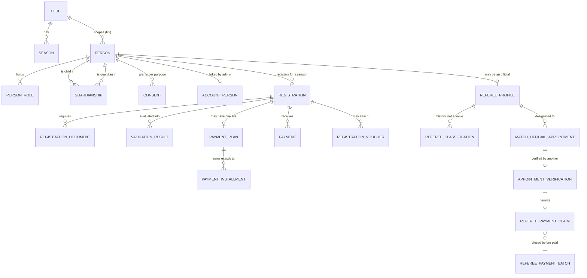
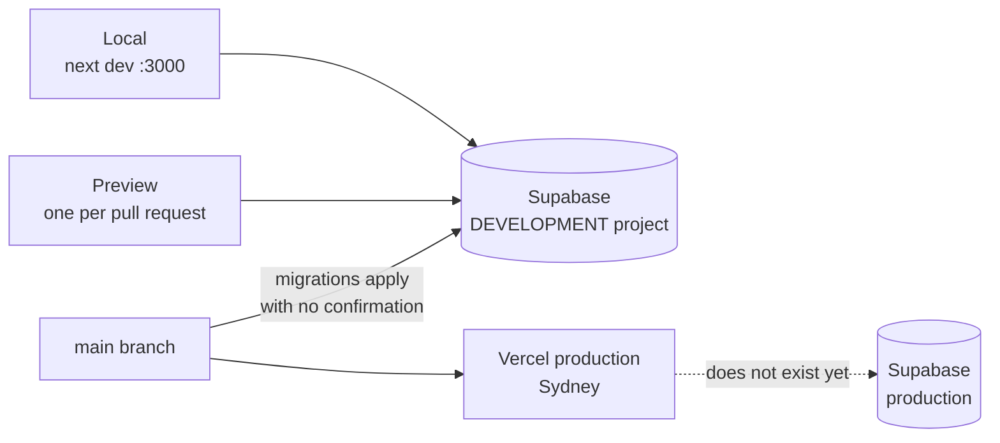
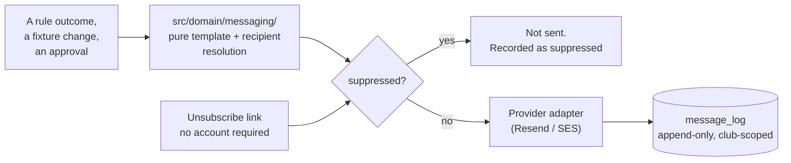

# Let'sDataTalk — Technical Design

_[← specs](./README.md) · [Requirements](./requirements.md) · [Tasks](./tasks.md) · [Technology layer](../docs/ea/5_technology/README.md)_

How Let'sDataTalk is built: the decisions everything else follows from, the
patterns that implement them, and enough code and schema to build against.

Examples are taken from the working system, not invented for the document.
Where something is **not yet built**, the section says so and proposes the
design rather than describing one.

---

## 1. Context



**The boundary that matters:** nothing is written into a governing body's
system. A club's registrations leave as a **submission pack** — an
immutable, versioned file handed over through a recorded channel. Football
Queensland restricts API access to approved system partners, so the
integration is a commercial question, not a technical one.

---

## 2. The decision everything hangs from

**Tenant isolation is enforced by the database, not by application code.**

There are two ways to keep Principle P5's promise. Remember
`where club_id = …` in every query forever — which fails through an ordinary
omission, silently, and leaks children's personal data. Or make the database
refuse, so a query missing its filter returns *nothing* rather than
*everything*.

Supabase was chosen for that property and essentially that property.

| Concern | Choice | Consequence |
| ------- | ------ | ----------- |
| Database, auth, access control | Supabase (managed Postgres + Auth + RLS) | P5 becomes structural; the permission model cannot drift from the data model |
| Application framework | Next.js App Router, TypeScript | One codebase for server-rendered screens and the API a mobile client would call |
| Hosting / CI-CD | Vercel | A preview deployment per pull request |
| File storage | Supabase Storage | A photo cannot be more readable than the row referencing it |
| Region | Sydney `ap-southeast-2` | Children's data onshore |

**The cost:** vendor concentration — database, auth, storage and policy with
one provider. The mitigation is that it is Postgres underneath, so the data
and schema stay portable even where the platform is not.

---

## 3. Layering



The purity of `src/domain/` and `src/web/` is **compiled, not requested**:

```jsonc
// tsconfig.domain.json — the second pass of `npm run typecheck`
{
  "extends": "./tsconfig.json",
  "compilerOptions": {
    "lib": ["ES2023"],        // no "DOM" — this is the whole point
    "types": ["node"],
    "noEmit": true
  },
  "include": ["src/domain/**/*.ts", "src/web/**/*.ts"]
}
```

A `document.` or `window.` in either directory fails the build. So does
importing React or `@supabase/supabase-js`. That buys three things: every
rule is unit-testable without a database; every screen *decision* is
testable without a browser; and the rule set stays diffable, by a human,
against the 126 rules in the business layer.

---

## 4. The rules engine

Every rule is a pure function from a context to an outcome carrying the
rule's identifier.

```ts
// src/domain/rules/types.ts
export type RuleId = `BR${number}`;

export interface RuleOutcome {
  readonly ruleId: RuleId;
  readonly status: 'pass' | 'fail';
  /** Plain enough for a registrar or a guardian to act on. */
  readonly message: string;
}

export interface RegistrationRule {
  readonly id: RuleId;
  readonly summary: string;
  readonly evaluate: (context: RegistrationContext) => RuleOutcome;
}
```

A rule implementation — note that the *message* is part of the product, not
decoration. "$80.32 outstanding" and "$80.32 outstanding, and you missed the
instalment due on 1 April" send a family to two different places:

```ts
// src/domain/rules/br3-outstanding-payment.ts (abridged)
export const br3OutstandingPayment: RegistrationRule = {
  id: 'BR3',
  summary: 'Nothing is outstanding',
  evaluate: ({ registration, paymentPlan, payments, asAt }) => {
    const outstanding = registration.outstandingAmountCents;

    if (outstanding <= 0) {
      return pass('BR3', outstanding === 0
        ? 'Nothing outstanding.'
        : `Paid in full, with a credit of ${formatMoney(-outstanding)}.`);
    }

    if (paymentPlan !== null && paymentPlan.cancelledAt === null) {
      const state = planState(paymentPlan.totalCents, paymentPlan.installments, payments, asAt);
      return fail('BR3', state.arrearsCents > 0
        ? `${formatMoney(outstanding)} outstanding, and ${formatMoney(state.arrearsCents)} of the payment plan is overdue.`
        : `${formatMoney(outstanding)} outstanding on a payment plan — up to date.`);
    }

    return fail('BR3', `${formatMoney(outstanding)} outstanding.`);
  },
};
```

The registry is the single place the code and the architecture are compared:

```ts
// src/domain/rules/index.ts
export const REGISTRATION_RULES: readonly RegistrationRule[] = [
  br55LegalNameVerified,
  br1GuardianRequired,
  br48ConsentRecorded,
  br2RequiredDocuments,
  br3OutstandingPayment,
];

export function evaluateRegistration(ctx: RegistrationContext): readonly RuleOutcome[] {
  return REGISTRATION_RULES.map((rule) => rule.evaluate(ctx));
}
```

**Passes are returned and persisted as well as failures.** The registrar's
screen shows what is done as well as what is left, and a stored pass is what
makes "what was wrong with this in March?" a query rather than a new
instrumentation project.

**Adding a rule** (Requirement 13.1): add the row to
`5_domain-context-and-rules.md` first, then a `br<n>-<name>.ts` with its
rationale in the header comment, then the entry in `REGISTRATION_RULES`.

---

## 5. Where a rule is enforced

The same rule is often expressed twice. That is not duplication — the two
answer different questions.

| Mechanism | For | Example |
| --------- | --- | ------- |
| **Pure domain function** | Rules whose *explanation* is the product | BR1, BR2, BR3, BR48, BR55 |
| **Database trigger** | Rules whose violation must be impossible | BR74 instalments, BR83/BR84 clearances, BR56 photo consent, BR87 committee adult, BR126 guardian invitation |
| **RLS policy** | Who may see or change a row at all | Every table; append-only expressed as the *absence* of an update policy |
| **`security definer` function** | Narrow, audited boundary crossings | `submit_public_registration`, `app_create_registration`, `merge_person`, `app_my_family_person_ids` |
| **Partial unique index** | Uniqueness that holds only in a state | One live payment plan per registration |

**The heuristic:** if getting it wrong costs a child their eligibility,
their privacy, or the club its money, it belongs in the database *as well
as* the domain. If getting it wrong merely produces a worse message, the
domain alone is enough.

### 5.1 A trigger, in full

BR74 — instalments sum to exactly the plan total. Deferred, so a plan and
its instalments can be inserted in one transaction and checked at commit:

```sql
create or replace function enforce_installments_sum_to_total()
returns trigger language plpgsql as $$
declare
  v_total    bigint;
  v_sum      bigint;
begin
  select total_cents into v_total from payment_plan
   where id = coalesce(new.payment_plan_id, old.payment_plan_id);

  select coalesce(sum(amount_cents), 0) into v_sum from payment_installment
   where payment_plan_id = coalesce(new.payment_plan_id, old.payment_plan_id);

  if v_sum <> v_total then
    raise exception 'BR74: instalments total %, plan total % — they must be equal',
      v_sum, v_total;
  end if;
  return null;
end $$;

create constraint trigger installments_sum_to_total
  after insert or update or delete on payment_installment
  deferrable initially deferred
  for each row execute function enforce_installments_sum_to_total();
```

The domain computes the schedule so this never fires in practice — and it
fires anyway if anything writes around it:

```ts
// src/domain/finance/plan.ts — cent-exact by construction
export function generateSchedule(totalCents: number, count: number, dueDates: readonly IsoDate[]) {
  const base = Math.floor(totalCents / count);
  const remainder = totalCents - base * count;     // 0 … count-1
  return dueDates.map((dueOn, i) => ({
    sequence: i + 1,
    dueOn,
    // The remainder lands on the earliest instalments, a cent each,
    // rather than being rounded away: $120.50 over three is 40.17 / 40.17 / 40.16.
    amountCents: base + (i < remainder ? 1 : 0),
  }));
}
```

---

## 6. The access model

Three clients, differing in exactly one way: whether RLS applies.

```ts
// src/data/client.ts
/** For the browser, and server code acting as the signed-in user. RLS applies. */
export function createUserClient(accessToken?: string): SupabaseClient { /* … */ }

/**
 * Reasons a caller may legitimately bypass Row-Level Security.
 *
 * A closed set rather than a free string, so every bypass is greppable and
 * the list itself is reviewable. Adding a member is a deliberate act.
 */
export type RlsBypassReason =
  | 'tenant-provisioning'          // before any membership row exists
  | 'scheduled-job'                // no signed-in user: BR50, BR51, BR67
  | 'submission-pack-generation';  // across a club's rows, for the registrar

export function createAdminClient(reason: RlsBypassReason): SupabaseClient { /* … */ }
```

**This is the pattern for any future privileged capability: make the escape
hatch enumerable.** `grep -rn "createAdminClient" src/` is a complete audit.

### 6.1 Policy shapes

Three shapes cover the schema. The third is the newest and the narrowest.

```sql
-- (a) Club membership. The baseline: anyone who may act at this club.
create policy registration_select on registration for select
  using (club_id in (select club_id from club_membership where user_id = auth.uid()));

-- (b) Role-narrowed (BR120). The data names the roles it is for.
--     A coach sees eligibility; the family's balance is not theirs to read.
create policy player_profile_select on player_profile for select
  using (club_id in (select app_member_club_ids(array['admin','registrar','coordinator','coach'])));

-- (c) Family (BR121, decision 11). Reached through a function keyed on the
--     caller's own session, never through a membership role — so a guardian
--     inherits none of the still-wide-open policies.
create policy registration_select_family on registration for select
  using (person_id in (select app_my_family_person_ids()));
```

```sql
-- The function behind (c): auth.uid() is read inside, never passed in,
-- so a caller cannot ask about somebody else's household.
create or replace function app_my_family_person_ids()
returns setof uuid language sql stable security definer set search_path = public as $$
  select ap.person_id from account_person ap where ap.user_id = auth.uid()
  union
  select g.person_id from guardianship g
    join account_person ap on ap.person_id = g.guardian_person_id
   where ap.user_id = auth.uid() and g.is_authority;
$$;
```

**Append-only needs no mechanism — it needs an omission:**

```sql
alter table payment enable row level security;
create policy payment_select on payment for select using (/* … */);
create policy payment_insert on payment for insert with check (/* … */);
-- No update policy. No delete policy. With RLS on, an operation with no
-- policy is denied. BR77 is enforced by what is absent (Requirement 17.5).
```

### 6.2 The only anonymous write

```sql
create or replace function submit_public_registration(
  p_token text, p_payload jsonb
) returns uuid
language plpgsql security definer set search_path = public as $$
declare v_inv registration_invitation;
begin
  select * into v_inv from registration_invitation
   where token_hash = encode(digest(p_token, 'sha256'), 'hex')
     and revoked_at is null and expires_at > now();

  -- Unknown, revoked and expired fail identically: the response must not
  -- reveal which (Requirement 9.5).
  if v_inv is null then
    raise exception 'This registration link is not valid.';
  end if;

  -- The tenant comes from the token, never from the caller (Requirement 9.4).
  return app_create_registration(v_inv.club_id, v_inv.season_id, p_payload);
end $$;

revoke all on function submit_public_registration(text, jsonb) from public;
grant execute on function submit_public_registration(text, jsonb) to anon;
```

---

## 7. Data model

The 45 tables, by slice. Every one carries `club_id` except the three noted.



**Four modelling decisions worth defending:**

1. **`person` is tenant-scoped, not global.** P1 (one Person) and P5 (no
   cross-tenant visibility) collide the moment a child plays for two clubs.
   Resolution: one row per club. P1 holds *within* a club — which is exactly
   the duplication it was written to prevent. Cross-club identity is BR44's
   matching problem and stays there; making `person` global would move the
   matching problem into the primary key while breaking P5 on the way.
2. **Two name columns, not a name and an alias** (Requirement 2.5).
3. **Consent is rows, not columns** (Requirement 11.1). Three purposes with
   independent grant, revocation and authority mean three lifecycles; a
   boolean records none of who, when, or revoked-on-Tuesday.
4. **The account link is its own table.** `club_membership` is unique on
   `(club_id, user_id, role)`, so an account holding both `admin` and
   `registrar` is two rows — a `person_id` column there would be stored
   twice and could disagree with itself.

**The three tables with no `club_id`,** each deliberately: `prospect` (a
stranger at the demonstration door belongs to no tenant), `platform_admin`
and `user_password_set` (whose policy is `using (false) with check (false)`,
so the API can neither read nor write them in either direction).

**History, not current values** — a recurring shape. A referee's
classification is dated rows (BR110); a fee schedule is a published version,
not an edited rate (BR115); a claim stores the amount it was computed at
(BR116); a superseded plan is cancelled, not replaced. Where a past answer
must stay answerable, the design stores rows and never overwrites.

---

## 8. Application patterns

### 8.1 One shape for every form result

```ts
// src/web/form-result.ts
export type FormResult =
  | { readonly status: 'idle' }
  | { readonly status: 'ok'; readonly message: string }
  | { readonly status: 'error'; readonly message: string };
```

Actions previously returned `string | null` — a message on failure, nothing
on success — so a registrar who recorded a clearance got no acknowledgement
and had to go and look. **Silence is not a success state:** it is
indistinguishable from a click that did not register, and it teaches people
to press twice.

### 8.2 A server action, end to end

```ts
// src/app/registrar/[registrationId]/actions.ts
'use server';

export async function recordPayment(_prev: FormResult, form: FormData): Promise<FormResult> {
  // 1. Parse in pure code, so the parsing is tested without a request.
  const parsed = parsePaymentForm(form);            // src/web/
  if (!parsed.ok) return formFailed(parsed.message);

  // 2. Act as the signed-in user. RLS decides whether this is permitted —
  //    BR78's treasurer-only rule is a policy, not an `if` here.
  const client = await createRequestClient();
  const { error } = await client.from('payment').insert(parsed.value);
  if (error) return formFailed(readableError(error));

  // 3. Re-derive status from the rules; never set it by hand.
  await revalidateRegistration(parsed.value.registrationId);
  return formOk(`Recorded ${formatMoney(parsed.value.amountCents)}.`);
}
```

**Three things are load-bearing.** Parsing is pure. Authorisation is the
policy, not the action — an action that forgot its check would be refused by
the database. And status is derived, never assigned.

`'use server'` modules may export **only async functions**: Next throws on a
bad export at *request* time, which is how a broken sign-in page once
shipped past a green build. `scripts/check_server_actions.py` is the gate.

### 8.3 Eligibility is asked, never stored

```ts
// src/domain/finance/eligibility.ts
export function mayTakeTheField(
  status: RegistrationStatus,
  outstandingCents: number,
): Eligibility {
  // BR79 is absolute and BR43 is a separate gate. Both, every time, fresh.
  if (outstandingCents > 0) {
    return { eligible: false, reason: `${formatMoney(outstandingCents)} outstanding (BR79).` };
  }
  if (status !== 'COMPLETE') {
    return { eligible: false, reason: `Registration is ${STATUS_LABEL[status]} (BR43).` };
  }
  return { eligible: true };
}
```

A stored eligibility flag is a cached answer that goes wrong quietly the
moment a payment lands. This one cannot.

### 8.4 Role context

```ts
// src/web/role-context.ts — BR61
export function resolveActive(held: readonly RoleContext[], requested: RoleKind | null) {
  if (held.length === 0) return { active: null, switchable: [] };
  if (held.length === 1) return { active: held[0], switchable: [] };   // no switch to offer
  const active = held.find((r) => r.kind === requested) ?? held[0];
  return { active, switchable: held.filter((r) => r !== active) };     // never merged
}
```

---

## 9. Verification

| Gate | Proves | CI job |
| ---- | ------ | ------ |
| `npm run typecheck` | Types — **twice**, the second pass DOM-free | `code-check` |
| `npm test` | 73 suites / 561 assertions, no build, no database | `code-check` |
| `npm run build` | The only check of Next's typed routes | `code-check` |
| `check_rls.py` | Every table has RLS, a policy and a `club_id` | `code-check` |
| `check_server_actions.py` | No `'use server'` module exports a non-async binding | `code-check` |
| `check_links.py` | Every relative link resolves | `docs-check` |
| **`test_rls.sh`** | **The real migrations against a real Postgres** | `rls-behaviour` |

The last one is the one that matters. `check_rls.py` proves a policy
*exists*; this proves it *works*. A policy can be present and wrong, and
that failure is silent until one club reads another's records.

```sql
-- supabase/tests/10_tenant_isolation.sql — the shape of every scenario
set local role authenticated;
set local request.jwt.claims = '{"sub":"<club A registrar>"}';

-- Written as the failure it would catch, not the behaviour it confirms.
do $$ begin
  if exists (select 1 from registration where club_id = '<club B>') then
    raise exception 'LEAK: club A registrar read club B registrations';
  end if;
end $$;
```

Under BR122, a policy that narrows by role ships with a scenario asserting
**the excluded role reads nothing** — a narrowing is proved by a test that
fails when it is widened.

---

## 10. Deployment



| Variable | Secret | Notes |
| -------- | ------ | ----- |
| `NEXT_PUBLIC_SUPABASE_URL` | No | Ships in the browser bundle by design |
| `NEXT_PUBLIC_SUPABASE_ANON_KEY` | No | Designed to be public. **Safe only because RLS is on every table** |
| `SUPABASE_SERVICE_ROLE_KEY` | **Yes** | Bypasses RLS entirely. Server scope only |
| `SUPABASE_DB_PASSWORD` | **Yes** | CLI only, for migrations; not needed at run time |

**Two consequences that have already caused confusion.** "Applied to
production" in this repository's history before September 2026 means applied
to the *development* project. And a migration merged to `main` runs against
the linked project with no second confirmation — which is why an applied
migration is never edited, and why a schema change never merges with an
unrun RLS test.

**A preview URL is effectively public.** Pointing one at real data would put
800 children's records behind a link anyone can open.

---

## 11. Designs for what is not built

Proposals, not decisions. Each needs the EA-first walk and a scope document.

### 11.1 Communications (Requirement 34)

The constraint behind three other absences, and a live compliance exposure:
marketing consent is collected today with **no unsubscribe**.



**Suppression state lives in Postgres, not at the provider**, so withdrawal
survives a provider change and is subject to the same RLS as everything
else. The template layer is pure, so what a message *says* is testable
without sending one.

### 11.2 Erasure and retention (Requirement 35)

The same machinery from two directions; build them together.

```sql
create table retention_basis (
  id uuid primary key default gen_random_uuid(),
  club_id uuid not null references club(id),
  person_id uuid not null references person(id),
  basis text not null,          -- 'statutory_financial' | 'child_safety' | 'active_eligibility' | 'life_member'
  expires_on date,              -- null = indefinite (BR70, a deceased life member)
  recorded_at timestamptz not null default now()
);
```

```ts
// A refusal has to be explainable, so it is a pure function like any rule.
export function erasureVerdict(bases: readonly RetentionBasis[], asAt: IsoDate): ErasureVerdict {
  const binding = bases.filter((b) => b.expiresOn === null || b.expiresOn >= asAt);
  return binding.length === 0
    ? { erase: true }
    : { erase: false, refusedBecause: binding.map((b) => b.basis) };  // BR49: name the basis
}
```

Execution is a Supabase scheduled function under
`createAdminClient('scheduled-job')` — the bypass reason already exists for
exactly this.

### 11.3 Carnivals and the public view (Requirement 28)

The one deliberate exception to P5, and it must be **narrow by
construction**, not by remembering to filter:

```sql
-- A published event's draw is readable by anyone, including `anon`.
-- The policy keys off publication, not off membership.
create policy carnival_fixture_select_public on carnival_fixture for select
  using (exists (
    select 1 from carnival_event e
     where e.id = carnival_fixture.event_id and e.published_at is not null
  ));
```

The safety property is in the **shape of the table**, not the policy: a
public carnival fixture carries club and team identifiers and **no
`person_id` column at all**, so there is no individual name for a filter to
forget (Requirement 28.4). Personal data would require a join the anonymous
role has no policy for.

### 11.4 Calendar distribution (Requirement 29)

A signed, rotatable feed token per Person, resolved to that Person's own
appointments only — never a club or competition schedule. The event body
carries competition, date, time, venue and the subscriber's own role, and
nothing about another participant. One-way: the platform's appointment stays
authoritative, and editing the event in a personal calendar accepts or
cancels nothing.

### 11.5 Lapsed licence enforcement (Requirement 6.7)

Currently *shown and not enforced*, which is worse than absent — the screen
asserts a control that does not exist. The fix belongs in the policies, not
in application guards that the next screen will forget:

```sql
create or replace function app_club_is_writable(p_club_id uuid)
returns boolean language sql stable as $$
  select exists (select 1 from club_licence
                  where club_id = p_club_id and state = 'active' and ends_on >= current_date);
$$;

-- Added to the `with check` of every write policy; reads are untouched,
-- because BR97 says read-only, not hidden.
```

---

## 12. Known limitations

Stated so the scope of what exists is not mistaken for the scope of what was
promised.

- **Nothing sends anything.** No email, SMS, reminder or unsubscribe.
- **Nothing takes money.** Square is chosen and unintegrated; a treasurer
  records what arrived. The same holds for officials: the club's own bank
  pays, and the platform records that it did.
- **Nothing forgets anything.** BR40 retention and BR49 erasure have no
  code.
- **No competitions catalogue**, so `fixture.competition` is free text.
- **No production environment.** Everything points at a development project
  that nonetheless holds the only copy of the data there is.
- **No performance budget, accessibility audit, or rehearsed restore.**
